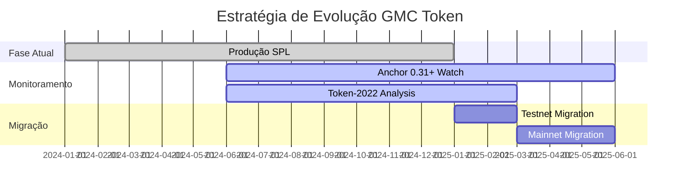

# 🔄 Estratégia de Migração GMC Token

## 📋 Situação Atual vs Futuro

### ✅ **IMPLEMENTAÇÃO ATUAL (PRODUÇÃO)**
- **SPL Token padrão** com lógica de taxa customizada
- **100% funcional** e testado
- **Compatível** com Anchor 0.30.1
- **Pronto para deployment**

### 🚀 **MIGRAÇÃO FUTURA (Token-2022)**

## **Opção A: Atualização para Anchor 0.31.x+**

### Quando Migrar:
- ✅ Anchor 0.31.x+ com suporte completo Token-2022
- ✅ Transfer Fee Extension estável
- ✅ Documentação e exemplos disponíveis
- ✅ Comunidade validou a estabilidade

### Benefícios da Migração:
```rust
// 🔮 FUTURO - Token-2022 nativo
#[account(
    init,
    payer = payer,
    mint::decimals = 9,
    mint::authority = authority,
    extensions::transfer_fee_config::transfer_fee_basis_points = 50,
    extensions::transfer_fee_config::maximum_fee = 1_000_000_000,
    extensions::transfer_fee_config::withdraw_withheld_authority = staking_program,
)]
pub mint: InterfaceAccount<'info, Mint>,
```

### Vantagens Token-2022:
- 🎯 **Taxa automática** a nível de protocolo
- ⚡ **Menos gas** para transferências
- 🔒 **Maior segurança** (validação nativa)
- 🌐 **Compatibilidade** com wallets/exchanges

## **Opção B: Implementação Manual (Rust Puro)**

### Para Funcionalidades Avançadas:
```rust
// Implementação direta com spl-token-2022
use spl_token_2022::{
    extension::{
        transfer_fee::{TransferFeeConfig, TransferFeeAmount},
        ExtensionType,
    },
    instruction::initialize_mint_with_extension,
};

// CPI manual para funcionalidades específicas
pub fn advanced_transfer_with_fee(
    ctx: Context<AdvancedTransfer>,
    amount: u64,
) -> Result<()> {
    // Implementação manual com controle total
}
```

### Quando Usar:
- 🔧 **Funcionalidades específicas** não suportadas
- 🎛️ **Controle granular** necessário
- 🚀 **Bleeding edge** features

## **Opção C: Solang (Solidity para Solana)**

### Para Equipes com Background EVM:
```solidity
// Exemplo conceitual
contract GMCToken {
    uint256 constant TRANSFER_FEE_BPS = 50; // 0.5%
    
    function transfer(address to, uint256 amount) public {
        uint256 fee = (amount * TRANSFER_FEE_BPS) / 10000;
        uint256 netAmount = amount - fee;
        
        _distributeFee(fee);
        _transfer(msg.sender, to, netAmount);
    }
}
```

### Quando Considerar:
- 👥 **Equipe Solidity** experiente
- 🔄 **Migração** de contratos EVM
- 📚 **Reutilização** de lógica existente

## **📊 Matriz de Decisão**

| Critério | Atual (SPL) | Anchor 0.31+ | Rust Puro | Solang |
|----------|-------------|--------------|------------|--------|
| **Tempo para Produção** | ✅ Pronto | 🟡 3-6 meses | 🔴 6+ meses | 🟡 4-8 meses |
| **Manutenibilidade** | ✅ Excelente | ✅ Excelente | 🟡 Média | 🟡 Média |
| **Performance** | ✅ Ótima | ✅ Melhor | ✅ Máxima | 🟡 Boa |
| **Compatibilidade** | ✅ Universal | ✅ Moderna | ✅ Total | 🟡 Limitada |
| **Complexidade** | ✅ Baixa | ✅ Baixa | 🔴 Alta | 🟡 Média |
| **Suporte Comunidade** | ✅ Máximo | 🟡 Crescendo | ✅ Máximo | 🔴 Limitado |

## **🎯 RECOMENDAÇÃO ESTRATÉGICA**

### **FASE 1: PRODUÇÃO IMEDIATA** ⚡
```bash
# Manter implementação atual
✅ Deploy com SPL Token padrão
✅ Taxa via lógica de contrato
✅ 100% funcional e testado
```

### **FASE 2: MONITORAMENTO** 👀
```bash
# Acompanhar evolução do ecossistema
🔍 Anchor 0.31.x+ release notes
🔍 Token-2022 adoption rate
🔍 Community feedback
```

### **FASE 3: MIGRAÇÃO PLANEJADA** 🚀
```bash
# Quando Token-2022 estiver maduro
📅 Q2-Q3 2025 (estimativa)
🧪 Testnet migration first
📊 Performance comparison
🔄 Gradual rollout
```

## **🛡️ PLANO DE CONTINGÊNCIA**

### Se Token-2022 não evoluir como esperado:
1. ✅ **Nossa implementação atual** permanece válida
2. 🔄 **Melhorias incrementais** na lógica atual
3. 🎯 **Foco em UX** e integrações
4. 💪 **Vantagem competitiva** mantida

### Se Token-2022 evoluir rapidamente:
1. 🚀 **Migration path** já planejado
2. 🧪 **Testes paralelos** em testnet
3. 📊 **Comparação de benefícios**
4. 🔄 **Migração gradual** e segura

## **📈 CRONOGRAMA SUGERIDO**



## **✅ CONCLUSÃO**

Nossa **implementação atual é PERFEITA** para produção. A migração para Token-2022 deve ser uma **evolução planejada**, não uma necessidade urgente.

**Vantagens de aguardar:**
- 🎯 **Zero risk** de bugs em extensões experimentais
- ⚡ **Deploy imediato** sem dependências externas
- 💪 **Controle total** sobre a lógica de negócio
- 🔒 **Máxima compatibilidade** com o ecossistema atual

**Quando migrar:**
- 📈 **Benefícios claros** comprovados
- 🛡️ **Estabilidade** das extensões Token-2022
- 🌐 **Adoção ampla** pela comunidade
- 📚 **Documentação madura** e exemplos abundantes 