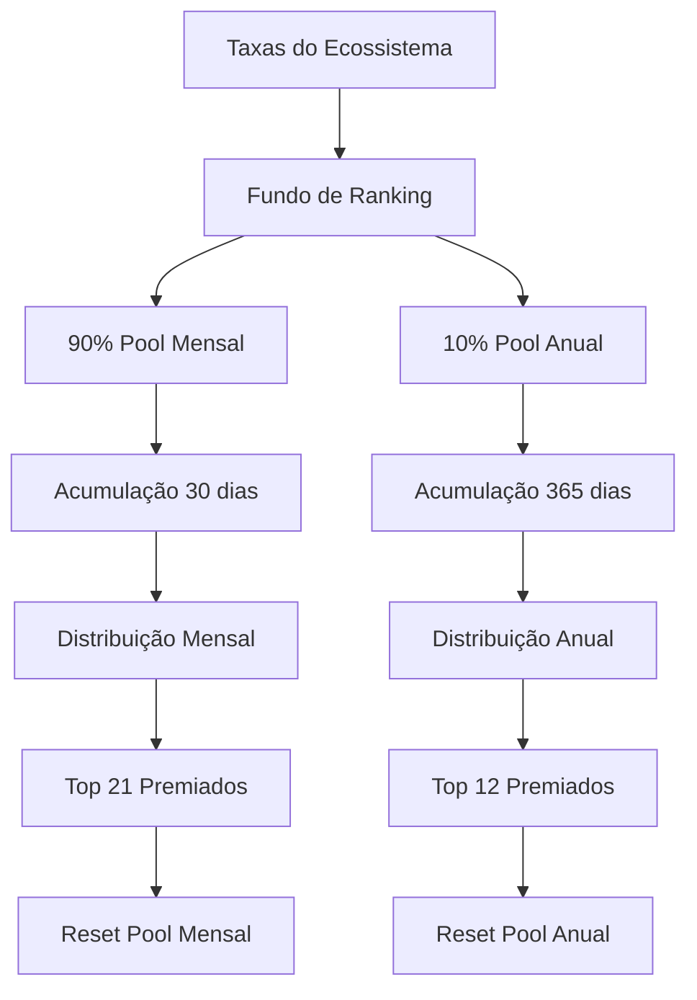

# 📊 Análise do Fundo de Ranking GMC Ecosystem

## 🎯 **Resumo Executivo**

Este documento analisa a origem das taxas que alimentam o fundo de ranking, como são distribuídas entre os pools mensal e anual, e as diferenças de timing entre as distribuições.

---

## 💰 **Origem das Taxas do Fundo de Ranking**

### **1. Taxa de Transação GMC (0,5%)**
- **Origem:** Todas as transferências de GMC
- **Distribuição:** 10% da taxa total → Fundo de Ranking
- **Valor Real:** 0,05% do valor transferido

### **2. Fee de Entrada no Staking (USDT)**
- **Origem:** Taxa variável em USDT sobre valor em GMC depositado
- **Distribuição:** 20% da taxa → Fundo de Ranking
- **Tiers:** 10%, 5%, 2,5%, 1%, 0,5% do valor em GMC

### **3. Penalidade de Saque Antecipado**
- **Origem:** Saques antecipados do staking longo prazo
- **Distribuição:** 20% da penalidade → Fundo de Ranking

### **4. Taxa de Cancelamento Staking Flexível (2,5%)**
- **Origem:** Cancelamentos de staking flexível
- **Distribuição:** 20% da taxa → Fundo de Ranking

### **5. Taxa de Saque de Juros GMC (1%)**
- **Origem:** Saques de juros em GMC
- **Distribuição:** 10% da taxa → Fundo de Ranking

### **6. Fee para Burn-for-Boost**
- **Origem:** Operações de queima para boost
- **Distribuição:** 10% da taxa → Fundo de Ranking

### **7. Taxa de Saque de Recompensas USDT (0,3%)**
- **Origem:** Saques de recompensas em USDT
- **Distribuição:** 20% da taxa → Fundo de Ranking

---

## 🔄 **Distribuição Interna do Fundo de Ranking**

### **Estrutura de Distribuição (90% Mensal / 10% Anual)**

```rust
// Código do programa de ranking (programs/gmc_ranking/src/lib.rs:206-213)
// 90% para pool mensal, 10% para pool anual
let monthly_gmc = gmc_amount.checked_mul(90).unwrap().checked_div(100).unwrap();
let annual_gmc = gmc_amount.checked_sub(monthly_gmc).unwrap();

let monthly_usdt = usdt_amount.checked_mul(90).unwrap().checked_div(100).unwrap();
let annual_usdt = usdt_amount.checked_sub(monthly_usdt).unwrap();
```

### **Pools Separados com Timing Diferente**

| Pool | Distribuição | Frequência | Reset | Premiados |
|:---|:---|:---|:---|:---|
| **Mensal** | 90% dos fundos | Mensal (30 dias) | Reset completo | Top 21 (7+7+7) |
| **Anual** | 10% dos fundos | Anual (365 dias) | Reset completo | Top 12 |

---

## ⏰ **Diferenças de Timing e Acumulação**

### **Pool Mensal**
- **Acumulação:** 30 dias
- **Distribuição:** Todo mês
- **Reset:** Completo após distribuição
- **Característica:** Pool menor, mas distribuição frequente

### **Pool Anual**
- **Acumulação:** 365 dias (12 meses)
- **Distribuição:** Uma vez por ano
- **Reset:** Completo após distribuição
- **Característica:** Pool acumulativo, distribuição única

---

## 📈 **Análise Comparativa dos Ganhos**

### **Exemplo Prático: Fundo de 100.000 GMC**

| Período | Pool Mensal | Pool Anual | Diferença |
|:---|:---|:---|:---|
| **Distribuição** | 90.000 GMC | 10.000 GMC | **9x maior** |
| **Frequência** | 12x/ano | 1x/ano | **12x mais frequente** |
| **Ganho Anual Total** | 1.080.000 GMC | 10.000 GMC | **108x maior** |

### **Por que o Pool Anual é Menor?**

1. **Incentivo ao Engajamento Contínuo:** Rankings mensais incentivam atividade regular
2. **Recompensa de Fidelidade:** Pool anual como bônus para consistência anual
3. **Sustentabilidade:** Pool menor evita inflação excessiva
4. **Foco em Queimadores:** Pool anual específico para top 12 queimadores

---

## 🎯 **Estratégias de Otimização**

### **Para Maximizar Ganhos Mensais:**
1. **Foque nas 3 Categorias:** Queimadores, Recrutadores, Transacionadores
2. **Atividade Consistente:** Mantenha volume mensal alto
3. **Timing:** Acompanhe o ciclo mensal de distribuição

### **Para Qualificar ao Pool Anual:**
1. **Queima Consistente:** Mantenha volume de queima ao longo do ano
2. **Exclusão:** Evite estar entre top 20 holders
3. **Persistência:** Atividade contínua por 12 meses

---

## 🔧 **Implementação Técnica**

### **Função de Distribuição de Fundos**
```rust
pub fn deposit_funds(ctx: Context<DepositFunds>, gmc_amount: u64, usdt_amount: u64) -> Result<()> {
    let ranking_state = &mut ctx.accounts.ranking_state;
    
    // 90% para pool mensal, 10% para pool anual
    let monthly_gmc = gmc_amount.checked_mul(90).unwrap().checked_div(100).unwrap();
    let annual_gmc = gmc_amount.checked_sub(monthly_gmc).unwrap();
    
    let monthly_usdt = usdt_amount.checked_mul(90).unwrap().checked_div(100).unwrap();
    let annual_usdt = usdt_amount.checked_sub(monthly_usdt).unwrap();
    
    // Acumula nos pools respectivos
    ranking_state.monthly_pool_gmc = ranking_state.monthly_pool_gmc.checked_add(monthly_gmc)?;
    ranking_state.annual_pool_gmc = ranking_state.annual_pool_gmc.checked_add(annual_gmc)?;
    ranking_state.monthly_pool_usdt = ranking_state.monthly_pool_usdt.checked_add(monthly_usdt)?;
    ranking_state.annual_pool_usdt = ranking_state.annual_pool_usdt.checked_add(annual_usdt)?;
    
    Ok(())
}
```

### **Distribuição Mensal (30 dias)**
```rust
pub fn distribute_monthly_rewards(ctx: Context<DistributeMonthlyRewards>) -> Result<()> {
    // Verificar se passou 30 dias desde a última distribuição
    let thirty_days = 30 * 24 * 60 * 60;
    require!(
        clock.unix_timestamp >= ranking_state.last_monthly_distribution + thirty_days,
        RankingError::DistributionTooEarly
    );
    
    // Reset dos pools mensais após distribuição
    ranking_state.monthly_pool_gmc = 0;
    ranking_state.monthly_pool_usdt = 0;
}
```

### **Distribuição Anual (365 dias)**
```rust
pub fn distribute_annual_rewards(ctx: Context<DistributeAnnualRewards>) -> Result<()> {
    // Verificar se passou 1 ano desde a última distribuição
    let one_year = 365 * 24 * 60 * 60;
    require!(
        clock.unix_timestamp >= ranking_state.last_annual_distribution + one_year,
        RankingError::DistributionTooEarly
    );
    
    // Reset dos pools anuais após distribuição
    ranking_state.annual_pool_gmc = 0;
    ranking_state.annual_pool_usdt = 0;
}
```

---

## 📊 **Fluxo Completo de Taxas**



---

## 🎯 **Conclusões**

### **Por que o Top 21 Ganha Mais que o Top 12 Anual:**

1. **Pool Maior:** 90% vs 10% dos fundos
2. **Frequência:** 12x vs 1x por ano
3. **Timing:** Acumulação de 30 dias vs 365 dias
4. **Estratégia:** Incentivo ao engajamento contínuo vs recompensa de fidelidade

### **Recomendações:**

1. **Foque nos Rankings Mensais:** Muito mais lucrativos
2. **Mantenha Atividade Consistente:** Para qualificar em ambos
3. **Otimize por Categoria:** Queimadores, recrutadores, transacionadores
4. **Acompanhe os Ciclos:** Timing das distribuições

---

**Documento criado em:** Janeiro 2025  
**Versão:** 1.0  
**Status:** Análise Completa  
**Próxima Revisão:** Após feedback dos stakeholders 