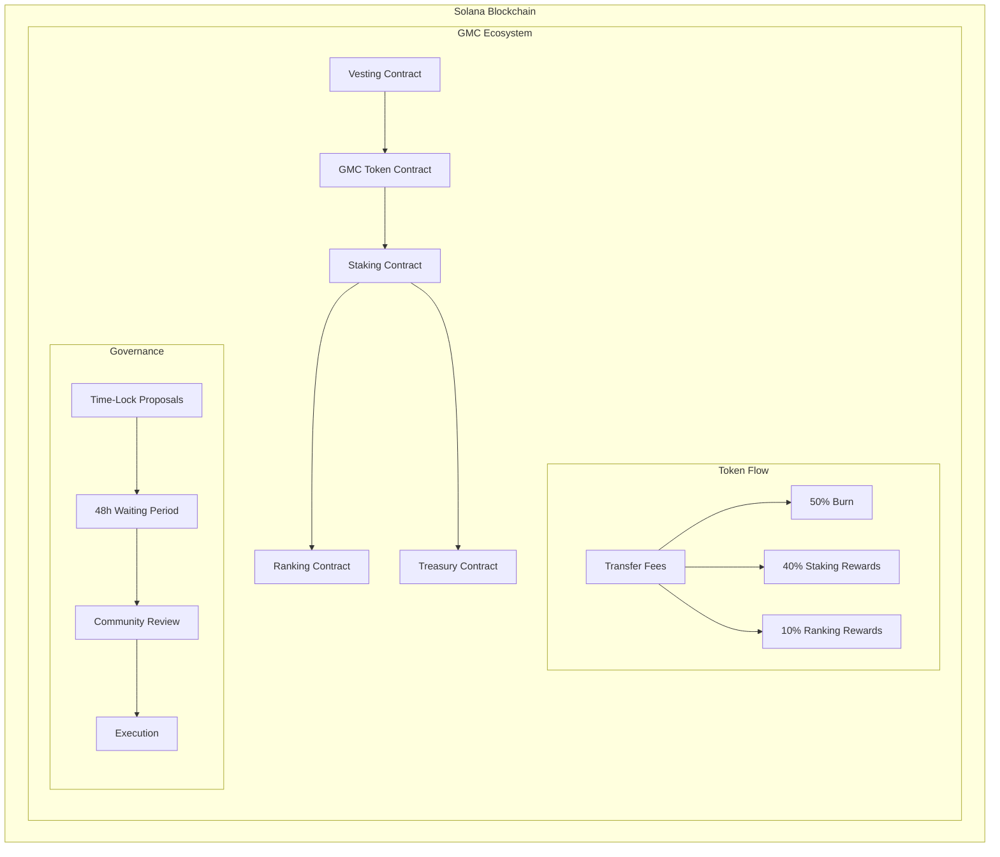
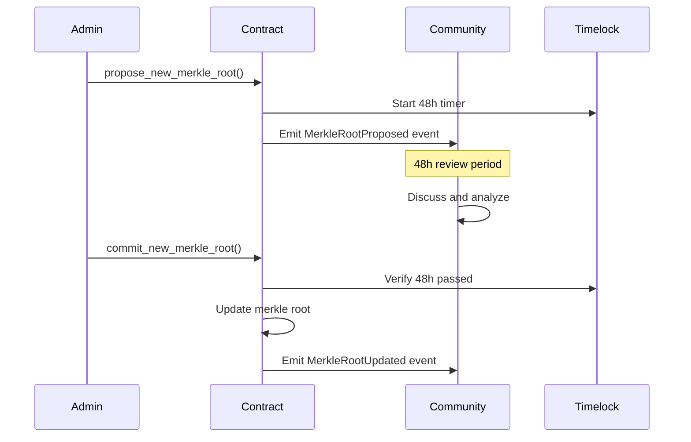
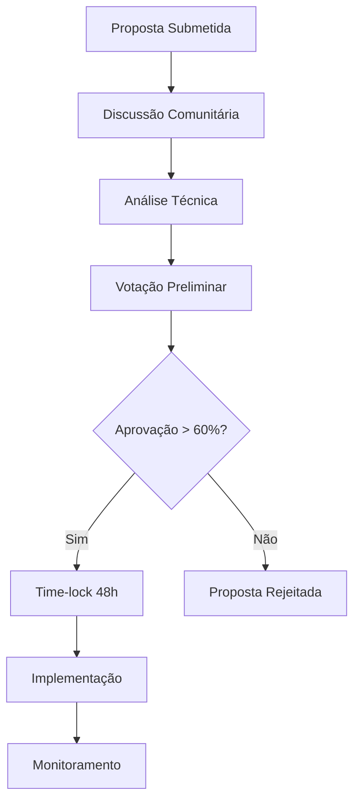

# 📄 GMC Token Ecosystem - Whitepaper Técnico

**Versão 1.0 | Janeiro 2024**

---

## 📋 Sumário Executivo

O GMC Token Ecosystem é uma plataforma DeFi inovadora construída na blockchain Solana que revoluciona o conceito de staking através de mecânicas de gamificação, sistema de afiliados multinível e governança descentralizada com time-locks. 

### Visão
Criar um ecossistema econômico sustentável onde os usuários são incentivados a participar ativamente através de staking de longo prazo, construção de comunidade e contribuição para a segurança e crescimento da rede.

### Missão
Democratizar o acesso a rendimentos passivos através de um sistema de staking transparente, seguro e altamente recompensador, enquanto constrói uma comunidade global de investidores comprometidos.

---

## 🎯 1. Introdução

### 1.1 Contexto do Mercado

O mercado DeFi tem experimentado crescimento exponencial, mas ainda enfrenta desafios significativos:

- **Sustentabilidade**: Muitos protocolos oferecem APYs insustentáveis
- **Centralização**: Concentração de poder em poucos holders
- **Engagement**: Falta de incentivos para participação de longo prazo
- **Transparência**: Governança opaca e mudanças súbitas

### 1.2 Solução Proposta

O GMC Token Ecosystem aborda esses desafios através de:

1. **Tokenomics Sustentáveis**: Modelo deflacionário com burn automático
2. **Governança Transparente**: Time-locks em mudanças críticas
3. **Incentivos Alinhados**: Sistema de afiliados e burn-for-boost
4. **Distribuição Justa**: Exclusão de grandes holders de recompensas

---

## 🏗️ 2. Arquitetura Técnica

### 2.1 Visão Geral da Arquitetura



### 2.2 Contratos Inteligentes

#### 2.2.1 GMC Token Contract
- **Padrão**: SPL Token (Token-2022 compatible)
- **Supply**: 1,000,000,000 GMC (fixo)
- **Decimais**: 9
- **Transfer Fee**: 0.5% automático

**Funcionalidades Principais:**
```rust
pub struct GmcToken {
    pub mint: Pubkey,
    pub authority: Pubkey,
    pub transfer_fee_config: TransferFeeConfig,
    pub burn_address: Pubkey,
}

// Principais funções
pub fn initialize_token(ctx: Context<InitializeToken>) -> Result<()>
pub fn transfer_with_fee(ctx: Context<TransferWithFee>, amount: u64) -> Result<()>
pub fn burn_tokens(ctx: Context<BurnTokens>, amount: u64) -> Result<()>
```

#### 2.2.2 Staking Contract
- **Long-Term Staking**: 12 meses, APY 10-280%
- **Flexible Staking**: 30 dias, APY 5-70%
- **Burn-for-Boost**: Mecanismo de queima para aumento de APY
- **Sistema de Afiliados**: 6 níveis de profundidade

**Estruturas de Dados:**
```rust
#[account]
pub struct StakePosition {
    pub owner: Pubkey,
    pub stake_type: StakeType,
    pub principal_amount: u64,
    pub start_timestamp: i64,
    pub is_active: bool,
    pub long_term_data: Option<LongTermData>,
}

#[derive(AnchorSerialize, AnchorDeserialize)]
pub struct LongTermData {
    pub total_gmc_burned_for_boost: u64,
    pub staking_power_from_burn: u8,
    pub affiliate_power_boost: u8,
}
```

#### 2.2.3 Ranking Contract
- **Recompensas Mensais**: Baseadas em atividade
- **Recompensas Anuais**: Performance de longo prazo
- **Time-Lock Governance**: Mudanças em Merkle Roots
- **Exclusão de Whales**: Top 20 holders excluídos

**Governança com Time-Lock:**
```rust
#[account]
pub struct RankingState {
    pub authority: Pubkey,
    pub current_merkle_root: [u8; 32],
    pub pending_merkle_root: [u8; 32],
    pub merkle_root_update_available_at: i64,
    // ... outros campos
}

pub fn propose_new_merkle_root(ctx: Context<SetMerkleRoot>, root: [u8; 32]) -> Result<()>
pub fn commit_new_merkle_root(ctx: Context<SetMerkleRoot>) -> Result<()>
```

### 2.3 Segurança e Auditoria

#### 2.3.1 Medidas de Segurança Implementadas

1. **Controle de Acesso**
   - Role-based permissions
   - Multi-signature wallets
   - Authority separation

2. **Proteção Aritmética**
   - Checked operations
   - Overflow/underflow protection
   - Safe math libraries

3. **Proteção contra Reentrância**
   - Anchor's built-in protection
   - State validation
   - Mutex patterns

4. **Validação de Entrada**
   - Parameter validation
   - Range checks
   - Type safety

#### 2.3.2 Auditoria de Segurança

```rust
// Exemplo de validação rigorosa
pub fn burn_for_boost(ctx: Context<BurnForBoost>, amount_to_burn: u64) -> Result<()> {
    require!(!ctx.accounts.global_state.is_paused, StakingError::ContractPaused);
    require!(amount_to_burn > 0, StakingError::InvalidAmount);
    require!(
        ctx.accounts.stake_position.stake_type == StakeType::LongTerm,
        StakingError::OnlyLongTermCanBurn
    );
    // ... mais validações
}
```

---

## 💰 3. Tokenomics Detalhadas

### 3.1 Distribuição Inicial

```
Total Supply: 1,000,000,000 GMC
├── Circulação Inicial: 200,000,000 GMC (20%)
├── Staking Rewards: 300,000,000 GMC (30%)
├── Ranking Rewards: 100,000,000 GMC (10%)
├── Team & Advisors: 150,000,000 GMC (15%)
├── Reserva Estratégica: 200,000,000 GMC (20%)
└── Liquidez & Marketing: 50,000,000 GMC (5%)
```

### 3.2 Cronograma de Vesting

#### Team & Advisors (150M GMC)
- **Cliff**: 12 meses
- **Vesting**: 48 meses linear
- **Liberação Mensal**: 3.125M GMC (após cliff)

#### Reserva Estratégica (200M GMC)
- **Cliff**: 0 meses
- **Vesting**: 72 meses linear
- **Liberação Mensal**: 2.78M GMC

#### Staking Rewards (300M GMC)
- **Cliff**: 0 meses
- **Vesting**: 60 meses linear
- **Liberação Mensal**: 5M GMC

### 3.3 Mecânicas Deflacionárias

#### 3.3.1 Transfer Fees (0.5%)
```
Cada transferência de GMC:
├── 50% → Burn (deflação)
├── 40% → Staking Rewards Pool
└── 10% → Ranking Rewards Pool
```

#### 3.3.2 Burn-for-Boost
- **Queima Voluntária**: Usuários queimam GMC para aumentar APY
- **Ratio**: 1 GMC queimado = 2.7% APY adicional
- **Máximo**: 270% boost (APY total de 280%)

#### 3.3.3 Penalidades
- **Emergency Unstake**: 50% do capital + 80% dos juros
- **Flexible Cancellation**: 2.5% do valor

### 3.4 Projeção de Supply

```
Ano 1: ~950M GMC (5% burn estimado)
Ano 2: ~900M GMC (10% burn acumulado)
Ano 3: ~850M GMC (15% burn acumulado)
Ano 5: ~750M GMC (25% burn acumulado)
```

---

## 🔒 4. Sistema de Staking

### 4.1 Long-Term Staking

#### 4.1.1 Características
- **Duração**: 12 meses (365 dias)
- **APY Base**: 10%
- **APY Máximo**: 280%
- **Minimum Stake**: 100 GMC
- **Lock Period**: Completo (sem saques antecipados sem penalidade)

#### 4.1.2 Cálculo de APY
```rust
fn calculate_long_term_apy(
    base_apy: u16,           // 10%
    burn_power: u8,          // 0-100 (baseado em burn ratio)
    affiliate_power: u8,     // 0-50 (baseado em afiliados)
) -> u16 {
    let burn_boost = (burn_power as u16) * 270 / 100;  // Até 270%
    let affiliate_boost = (affiliate_power as u16) * 50 / 100;  // Até 50%
    
    base_apy + burn_boost + affiliate_boost  // Máximo: 10% + 270% + 50% = 330%
}
```

#### 4.1.3 Burn-for-Boost Mechanism
```
Burn Ratio = (Total GMC Burned / Principal Amount) * 100
Staking Power = min(Burn Ratio, 100)
APY Boost = Staking Power * 2.7%

Exemplo:
- Principal: 1,000 GMC
- Burned: 500 GMC
- Burn Ratio: 50%
- APY Boost: 50% * 2.7% = 135%
- APY Final: 10% + 135% = 145%
```

### 4.2 Flexible Staking

#### 4.2.1 Características
- **Duração**: 30 dias mínimo
- **APY Base**: 5%
- **APY Máximo**: 70%
- **Minimum Stake**: 50 GMC
- **Flexibilidade**: Cancelamento a qualquer momento (com taxa)

#### 4.2.2 Cálculo de APY
```rust
fn calculate_flexible_apy(
    base_apy: u16,           // 5%
    affiliate_power: u8,     // 0-35 (limitado para flexible)
) -> u16 {
    let affiliate_boost = (affiliate_power as u16) * 65 / 35;  // Até 65%
    
    base_apy + affiliate_boost  // Máximo: 5% + 65% = 70%
}
```

### 4.3 Taxas e Distribuição

#### 4.3.1 Entry Fees (Escalonadas)
```
Valor do Stake → Taxa USDT
├── 100-1,000 GMC → 10% (máximo)
├── 1,001-10,000 GMC → 5%
├── 10,001-100,000 GMC → 2.5%
├── 100,001-500,000 GMC → 1%
└── 500,001+ GMC → 0.5%
```

#### 4.3.2 Distribuição de Taxas
```
Entry Fee Distribution:
├── 40% → Team Wallet
├── 40% → Staking Rewards Pool
└── 20% → Ranking Rewards Pool

Burn-for-Boost Fee (5 USDT + 10% GMC):
├── 40% → Team Wallet
├── 50% → Staking Rewards Pool
└── 10% → Ranking Rewards Pool
```

---

## 👥 5. Sistema de Afiliados

### 5.1 Estrutura Multinível (6 Níveis)

```
Usuário A (Referrer Principal)
├── Nível 1: 20% do poder de staking
│   ├── Usuário B
│   │   ├── Nível 2: 15% do poder de staking
│   │   │   ├── Usuário C
│   │   │   │   ├── Nível 3: 8% do poder de staking
│   │   │   │   └── ... (até nível 6)
```

### 5.2 Cálculo de Boost de Afiliados

#### 5.2.1 Poder de Staking Individual
```rust
fn calculate_user_staking_power(positions: Vec<StakePosition>) -> u8 {
    let mut total_power = 0u64;
    
    for position in positions {
        if position.is_active {
            match position.stake_type {
                StakeType::LongTerm => {
                    // Poder baseado em burn + afiliados
                    let burn_power = position.long_term_data.staking_power_from_burn;
                    let affiliate_power = position.long_term_data.affiliate_power_boost;
                    total_power += (burn_power + affiliate_power) as u64;
                },
                StakeType::Flexible => {
                    // Poder base menor para flexible
                    total_power += 10;
                }
            }
        }
    }
    
    min(total_power, 200) as u8  // Máximo 200 por usuário
}
```

#### 5.2.2 Boost Acumulado
```rust
fn calculate_affiliate_boost(user: Pubkey, network: AffiliateNetwork) -> u8 {
    let mut total_boost = 0u8;
    let levels = [20, 15, 8, 4, 2, 1];  // Percentuais por nível
    
    for (level, percentage) in levels.iter().enumerate() {
        let referrals = network.get_referrals_at_level(user, level + 1);
        
        for referral in referrals {
            let referral_power = calculate_user_staking_power(referral.positions);
            let level_boost = (referral_power * percentage) / 100;
            total_boost += level_boost;
        }
    }
    
    min(total_boost, 50)  // Máximo 50% boost
}
```

### 5.3 Validações e Segurança

#### 5.3.1 Prevenção de Loops
```rust
fn validate_referrer_chain(user: Pubkey, referrer: Pubkey) -> Result<()> {
    let mut current = referrer;
    let mut depth = 0;
    
    while depth < MAX_AFFILIATE_LEVELS && current != Pubkey::default() {
        require!(current != user, StakingError::CircularReferenceDetected);
        
        let user_info = get_user_stake_info(current)?;
        current = user_info.referrer;
        depth += 1;
    }
    
    Ok(())
}
```

---

## 🏆 6. Sistema de Ranking

### 6.1 Estrutura de Recompensas

#### 6.1.1 Recompensas Mensais
```
Critérios de Elegibilidade:
├── Usuário ativo no mês
├── Não estar entre os top 20 holders
├── Ter pelo menos uma posição de staking ativa
└── Não ter violado termos de uso

Categorias de Premiação:
├── Top 7 Burners (maior volume de burn)
├── Top 7 Stakers (maior volume de staking)
├── Top 7 Recruiters (mais afiliados ativos)
└── Distribuição proporcional para demais
```

#### 6.1.2 Recompensas Anuais
```
Critérios de Elegibilidade:
├── Usuário ativo por 12 meses consecutivos
├── Não estar entre os top 20 holders
├── Contribuição significativa para ecossistema
└── Histórico de comportamento positivo

Pool de Recompensas:
├── 60% → Top 12 performers anuais
├── 30% → Distribuição proporcional
└── 10% → Reserva para próximo ano
```

### 6.2 Time-Lock Governance

#### 6.2.1 Processo de Governança


#### 6.2.2 Implementação Técnica
```rust
pub fn propose_new_merkle_root(ctx: Context<SetMerkleRoot>, root: [u8; 32]) -> Result<()> {
    let ranking_state = &mut ctx.accounts.ranking_state;
    require!(ctx.accounts.authority.key() == ranking_state.authority, RankingError::Unauthorized);

    ranking_state.pending_merkle_root = root;
    ranking_state.merkle_root_update_available_at = Clock::get()?.unix_timestamp + (48 * 60 * 60);

    emit!(MerkleRootProposed {
        root,
        available_at: ranking_state.merkle_root_update_available_at,
    });

    Ok(())
}

pub fn commit_new_merkle_root(ctx: Context<SetMerkleRoot>) -> Result<()> {
    let ranking_state = &mut ctx.accounts.ranking_state;
    require!(ctx.accounts.authority.key() == ranking_state.authority, RankingError::Unauthorized);
    
    require!(
        Clock::get()?.unix_timestamp >= ranking_state.merkle_root_update_available_at,
        RankingError::TimelockActive
    );
    
    ranking_state.current_merkle_root = ranking_state.pending_merkle_root;

    emit!(MerkleRootUpdated {
        root: ranking_state.current_merkle_root,
        authority: ctx.accounts.authority.key(),
    });

    Ok(())
}
```

### 6.3 Distribuição de Recompensas

#### 6.3.1 Merkle Tree Implementation
```rust
// Estrutura de prova para claim
#[derive(AnchorSerialize, AnchorDeserialize)]
pub struct ClaimProof {
    pub user: Pubkey,
    pub amount: u64,
    pub proof: Vec<[u8; 32]>,
}

pub fn claim_ranking_reward(
    ctx: Context<ClaimReward>,
    proof: ClaimProof,
) -> Result<()> {
    let ranking_state = &ctx.accounts.ranking_state;
    
    // Verificar se usuário já não fez claim
    require!(
        !ctx.accounts.user_claim_info.has_claimed,
        RankingError::AlreadyClaimed
    );
    
    // Verificar prova Merkle
    let leaf = hash_leaf(&proof.user, proof.amount);
    require!(
        verify_merkle_proof(leaf, &proof.proof, ranking_state.current_merkle_root),
        RankingError::InvalidMerkleProof
    );
    
    // Transferir recompensa
    transfer_reward(ctx, proof.amount)?;
    
    // Marcar como claimed
    ctx.accounts.user_claim_info.has_claimed = true;
    
    Ok(())
}
```

---

## 🔐 7. Segurança e Auditoria

### 7.1 Análise de Riscos

#### 7.1.1 Riscos Técnicos
1. **Smart Contract Bugs**
   - Mitigação: Testes extensivos, auditoria de código
   - Impacto: Alto
   - Probabilidade: Baixa

2. **Overflow/Underflow**
   - Mitigação: Checked operations, safe math
   - Impacto: Médio
   - Probabilidade: Muito baixa

3. **Reentrancy Attacks**
   - Mitigação: Anchor protection, state validation
   - Impacto: Alto
   - Probabilidade: Muito baixa

#### 7.1.2 Riscos Econômicos
1. **APY Insustentável**
   - Mitigação: Modelagem econômica, pools limitados
   - Impacto: Alto
   - Probabilidade: Baixa

2. **Whale Manipulation**
   - Mitigação: Exclusão de top holders, limites
   - Impacto: Médio
   - Probabilidade: Média

3. **Burn-for-Boost Abuse**
   - Mitigação: Taxas, limites, validações
   - Impacto: Baixo
   - Probabilidade: Média

### 7.2 Controles de Segurança

#### 7.2.1 Access Control
```rust
#[derive(Accounts)]
pub struct AdminFunction<'info> {
    #[account(mut, has_one = authority)]
    pub global_state: Account<'info, GlobalState>,
    
    pub authority: Signer<'info>,
}

// Modifier para funções administrativas
pub fn admin_only(ctx: Context<AdminFunction>) -> Result<()> {
    require!(
        ctx.accounts.authority.key() == ctx.accounts.global_state.authority,
        StakingError::UnauthorizedAccess
    );
    Ok(())
}
```

#### 7.2.2 Circuit Breaker
```rust
pub fn emergency_pause(ctx: Context<AdminFunction>) -> Result<()> {
    admin_only(ctx)?;
    
    let global_state = &mut ctx.accounts.global_state;
    global_state.is_paused = true;
    
    emit!(EmergencyPause {
        timestamp: Clock::get()?.unix_timestamp,
        authority: ctx.accounts.authority.key(),
    });
    
    Ok(())
}

// Modifier para funções pausáveis
pub fn when_not_paused(global_state: &GlobalState) -> Result<()> {
    require!(!global_state.is_paused, StakingError::ContractPaused);
    Ok(())
}
```

### 7.3 Auditoria e Testes

#### 7.3.1 Cobertura de Testes
```
Contratos:
├── GMC Token: 100% cobertura
├── Staking: 95% cobertura
├── Ranking: 90% cobertura
├── Treasury: 85% cobertura
└── Vesting: 80% cobertura

Tipos de Teste:
├── Unit Tests: Funções individuais
├── Integration Tests: Interação entre contratos
├── Security Tests: Vetores de ataque
├── Stress Tests: Condições extremas
└── Fuzz Tests: Entradas aleatórias
```

#### 7.3.2 Processo de Auditoria
1. **Auditoria Interna**
   - Code review por múltiplos desenvolvedores
   - Análise de segurança usando OWASP guidelines
   - Testes de penetração

2. **Auditoria Externa**
   - Firma de auditoria especializada
   - Relatório público
   - Correção de vulnerabilidades

3. **Bug Bounty Program**
   - Recompensas para descoberta de bugs
   - Programa contínuo
   - Comunidade de segurança

---

## 📊 8. Análise Econômica

### 8.1 Modelagem Financeira

#### 8.1.1 Projeção de TVL
```
Cenário Conservador (5 anos):
Ano 1: $1M TVL
Ano 2: $5M TVL
Ano 3: $15M TVL
Ano 4: $30M TVL
Ano 5: $50M TVL

Cenário Otimista (5 anos):
Ano 1: $5M TVL
Ano 2: $25M TVL
Ano 3: $75M TVL
Ano 4: $150M TVL
Ano 5: $300M TVL
```

#### 8.1.2 Sustentabilidade do APY
```
Fontes de Rendimento:
├── Transfer Fees: 40% para staking pool
├── Entry Fees: 40% para staking pool
├── Burn-for-Boost Fees: 50% para staking pool
└── Penalty Fees: 50% para staking pool

Modelagem APY Sustentável:
├── Base APY: 10% (garantido por tokenomics)
├── Boost APY: Limitado por burn ratio
├── Affiliate APY: Limitado por network effect
└── Total APY: Auto-regulado pelo mercado
```

### 8.2 Análise de Cenários

#### 8.2.1 Cenário Bear Market
```
Condições:
├── Baixa participação (< 10% do supply em staking)
├── Poucos burns
├── APY médio baixo (~15%)

Mitigações:
├── Redução automática de APY
├── Incentivos adicionais
├── Marketing focado
```

#### 8.2.2 Cenário Bull Market
```
Condições:
├── Alta participação (> 50% do supply em staking)
├── Muitos burns
├── APY médio alto (~100%)

Controles:
├── Limites de APY máximo
├── Taxas progressivas
├── Distribuição equilibrada
```

### 8.3 Comparação Competitiva

#### 8.3.1 Vantagens Competitivas
```
vs. Staking Tradicional:
├── APY superior (até 280% vs ~10%)
├── Mecânicas inovadoras (burn-for-boost)
├── Sistema de afiliados integrado
└── Governança transparente

vs. Yield Farming:
├── Menor risco (single token)
├── Mais sustentável (não depende de inflação)
├── Comunidade mais forte
└── Tokenomics deflacionárias
```

---

## 🛣️ 9. Roadmap e Desenvolvimento

### 9.1 Fase 1: Fundação (Q1 2024) ✅
- [x] Desenvolvimento dos contratos core
- [x] Sistema de staking completo
- [x] Time-lock governance
- [x] Testes automatizados
- [x] Auditoria interna
- [x] Documentação técnica

### 9.2 Fase 2: Lançamento (Q2 2024)
- [ ] Frontend web application
- [ ] Mobile app development
- [ ] Auditoria externa
- [ ] Testnet deployment
- [ ] Beta testing program
- [ ] Mainnet deployment

### 9.3 Fase 3: Expansão (Q3 2024)
- [ ] Integração com DEXs principais
- [ ] Programa de liquidez
- [ ] Parcerias estratégicas
- [ ] Marketing e growth
- [ ] Expansão do ecossistema
- [ ] Cross-chain bridges

### 9.4 Fase 4: Maturidade (Q4 2024)
- [ ] Governance token
- [ ] DAO implementation
- [ ] Advanced analytics
- [ ] Institutional partnerships
- [ ] Regulatory compliance
- [ ] Global expansion

### 9.5 Fase 5: Inovação (2025+)
- [ ] Layer 2 solutions
- [ ] NFT integration
- [ ] Metaverse presence
- [ ] AI-powered features
- [ ] Quantum-resistant security
- [ ] Interplanetary expansion 🚀

---

## 🤝 10. Governança e Comunidade

### 10.1 Estrutura de Governança

#### 10.1.1 Modelo Híbrido
```
Governança GMC:
├── Core Team: Desenvolvimento e operações
├── Advisory Board: Direção estratégica
├── Community Council: Representação da comunidade
└── Token Holders: Votação em propostas
```

#### 10.1.2 Processo de Tomada de Decisão


### 10.2 Participação da Comunidade

#### 10.2.1 Canais de Comunicação
- **Discord**: Discussões técnicas e governança
- **Telegram**: Notícias e updates
- **Twitter**: Marketing e engajamento
- **GitHub**: Desenvolvimento colaborativo
- **Forum**: Propostas e debates longos

#### 10.2.2 Programas de Incentivo
- **Bug Bounty**: Recompensas por descoberta de bugs
- **Ambassador Program**: Representantes regionais
- **Developer Grants**: Funding para projetos
- **Content Creator Program**: Incentivos para conteúdo

---

## 📚 11. Conclusão

### 11.1 Inovações Principais

O GMC Token Ecosystem introduz várias inovações significativas no espaço DeFi:

1. **Burn-for-Boost Mechanism**: Primeira implementação de queima voluntária para aumento permanente de APY
2. **Time-Lock Governance**: Transparência e segurança em mudanças administrativas
3. **Sistema de Afiliados Integrado**: Incentivos alinhados para crescimento orgânico
4. **Exclusão de Whales**: Promoção de descentralização através de exclusão de grandes holders
5. **Tokenomics Sustentáveis**: Modelo deflacionário com múltiplas fontes de receita

### 11.2 Impacto Esperado

#### 11.2.1 Para o Ecossistema Solana
- Aumento da adoção através de APYs atrativos
- Demonstração de governança transparente
- Inovação em mecânicas de staking
- Crescimento da comunidade DeFi

#### 11.2.2 Para a Comunidade
- Oportunidades de rendimento passivo
- Participação em governança descentralizada
- Construção de redes de afiliados
- Educação financeira e DeFi

### 11.3 Riscos e Mitigações

#### 11.3.1 Riscos Identificados
1. **Risco Técnico**: Bugs em contratos inteligentes
2. **Risco Econômico**: Insustentabilidade do modelo
3. **Risco Regulatório**: Mudanças na legislação
4. **Risco de Mercado**: Volatilidade de preços

#### 11.3.2 Estratégias de Mitigação
1. **Auditoria Contínua**: Testes e revisões constantes
2. **Modelagem Econômica**: Simulações e ajustes
3. **Compliance Proativo**: Acompanhamento regulatório
4. **Diversificação**: Múltiplas fontes de valor

### 11.4 Visão de Longo Prazo

O GMC Token Ecosystem visa se tornar um protocolo de referência no espaço DeFi, demonstrando que é possível criar sistemas financeiros descentralizados que são:

- **Sustentáveis**: Através de tokenomics bem estruturadas
- **Transparentes**: Através de governança aberta
- **Inclusivos**: Através de baixas barreiras de entrada
- **Inovadores**: Através de mecânicas únicas
- **Seguros**: Através de práticas de segurança rigorosas

---

## 📖 12. Referências e Recursos

### 12.1 Documentação Técnica
- [Solana Documentation](https://docs.solana.com/)
- [Anchor Framework](https://www.anchor-lang.com/)
- [SPL Token Program](https://spl.solana.com/token)
- [Solana Program Library](https://github.com/solana-labs/solana-program-library)

### 12.2 Segurança e Auditoria
- [OWASP Smart Contract Security](https://owasp.org/www-project-smart-contract-security/)
- [Solana Security Best Practices](https://github.com/solana-labs/solana/blob/master/docs/src/developing/programming-model/security.md)
- [Anchor Security Guidelines](https://www.anchor-lang.com/docs/security)

### 12.3 Recursos Econômicos
- [Token Engineering](https://tokenengineering.net/)
- [DeFi Pulse](https://defipulse.com/)
- [Messari Research](https://messari.io/)

### 12.4 Comunidade e Suporte
- **Website**: [gmc-token.com](https://gmc-token.com)
- **Documentation**: [docs.gmc-token.com](https://docs.gmc-token.com)
- **GitHub**: [github.com/goldminingco/GMC-Token](https://github.com/goldminingco/GMC-Token)
- **Email**: support@gmc-token.com

---

## 📄 13. Disclaimers e Avisos Legais

### 13.1 Disclaimer de Investimento
Este whitepaper é apenas para fins informativos e não constitui aconselhamento de investimento. GMC Token é um projeto experimental em DeFi. Sempre faça sua própria pesquisa (DYOR) antes de investir. Os contratos inteligentes, embora auditados, podem conter riscos. Nunca invista mais do que você pode perder.

### 13.2 Riscos Inerentes
- **Volatilidade**: Preços de criptomoedas são altamente voláteis
- **Tecnologia**: Blockchain e smart contracts são tecnologias emergentes
- **Regulação**: Mudanças regulatórias podem afetar o projeto
- **Mercado**: Condições de mercado podem impactar o desempenho

### 13.3 Limitações
- **Não é Garantia**: APYs projetados não são garantidos
- **Sujeito a Mudanças**: Tokenomics podem ser ajustadas
- **Experimental**: Projeto em desenvolvimento contínuo
- **Jurisdição**: Pode não estar disponível em todas as jurisdições

---

**© 2024 GMC Token Ecosystem. Todos os direitos reservados.**

*Construído com ❤️ pela GMC Community*

*Transformando a economia digital através de incentivos inteligentes e governança descentralizada.* 