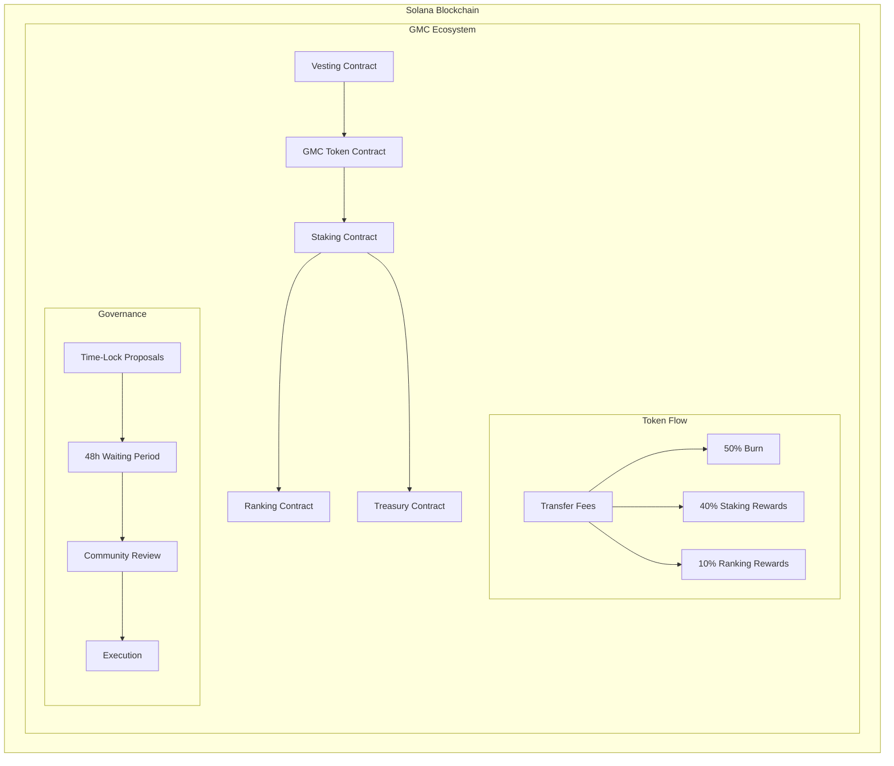
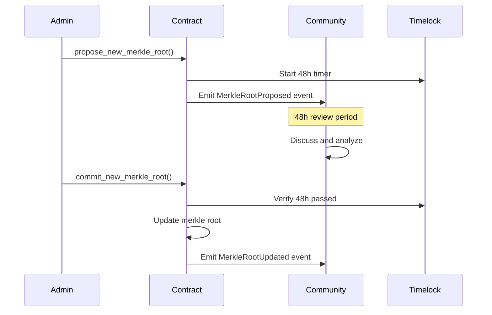
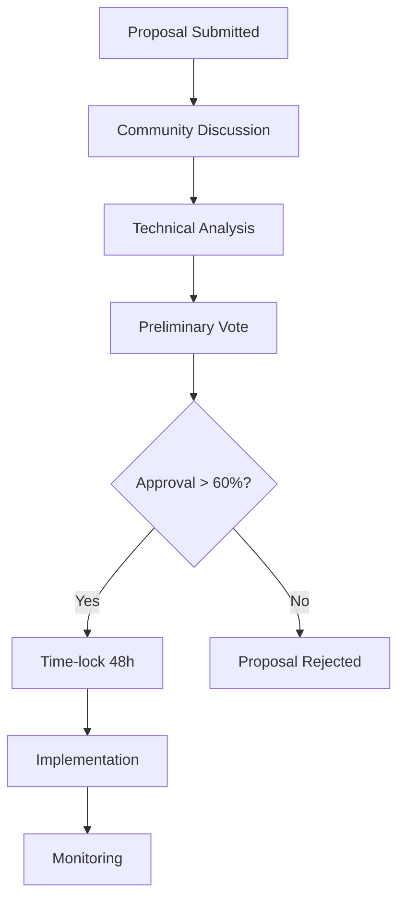

# 📄 GMC Token Ecosystem - Technical Whitepaper

**Version 1.1 (Ready for Audit) | July 2025**

---

## 📋 Executive Summary

The GMC Token Ecosystem is an innovative DeFi platform built on the Solana blockchain that revolutionizes the concept of staking through gamification mechanics, a multi-level affiliate system, and decentralized governance with time-locks.

### Vision
To create a sustainable economic ecosystem where users are incentivized to actively participate through long-term staking, community building, and contributing to the security and growth of the network.

### Mission
To democratize access to passive income through a transparent, secure, and highly rewarding staking system, while building a global community of committed investors.

---

## 🎯 1. Introduction

### 1.1 Market Context

The DeFi market has experienced exponential growth but still faces significant challenges:

- **Sustainability**: Many protocols offer unsustainable APYs.
- **Centralization**: Concentration of power among a few holders.
- **Engagement**: Lack of incentives for long-term participation.
- **Transparency**: Opaque governance and sudden changes.

### 1.2 Proposed Solution

The GMC Token Ecosystem addresses these challenges through:

1.  **Sustainable Tokenomics**: A deflationary model with automatic burning.
2.  **Transparent Governance**: Time-locks on critical changes.
3.  **Aligned Incentives**: Affiliate and burn-for-boost systems.
4.  **Fair Distribution**: Exclusion of large holders from rewards.

---

## 🏗️ 2. Technical Architecture

### 2.1 Architecture Overview



### 2.2 Smart Contracts

#### 2.2.1 GMC Token Contract
- **Standard**: SPL Token (Token-2022 compatible)
- **Supply**: 100,000,000 GMC (fixed)
- **Decimals**: 9
- **Transfer Fee**: 0.5% automatic

**Main Features:**
```rust
pub struct GmcToken {
    pub mint: Pubkey,
    pub authority: Pubkey,
    pub transfer_fee_config: TransferFeeConfig,
    pub burn_address: Pubkey,
}

// Main functions
pub fn initialize_token(ctx: Context<InitializeToken>) -> Result<()>
pub fn transfer_with_fee(ctx: Context<TransferWithFee>, amount: u64) -> Result<()>
pub fn burn_tokens(ctx: Context<BurnTokens>, amount: u64) -> Result<()>
```

#### 2.2.2 Staking Contract
- **Long-Term Staking**: 12 months, APY 10-280%
- **Flexible Staking**: 30 days, APY 5-70%
- **Burn-for-Boost**: Burn mechanism to increase APY
- **Affiliate System**: 6 levels deep

**Data Structures:**
```rust
#[account]
pub struct StakePosition {
    pub owner: Pubkey,
    pub stake_type: StakeType,
    pub principal_amount: u64,
    pub start_timestamp: i64,
    pub is_active: bool,
    pub long_term_data: Option<LongTermData>,
}

#[derive(AnchorSerialize, AnchorDeserialize)]
pub struct LongTermData {
    pub total_gmc_burned_for_boost: u64,
    pub staking_power_from_burn: u8,
    pub affiliate_power_boost: u8,
}
```

#### 2.2.3 Ranking Contract
- **Monthly Rewards**: Based on activity
- **Annual Rewards**: Long-term performance
- **Time-Lock Governance**: Changes to Merkle Roots
- **Whale Exclusion**: Top 20 holders excluded

**Governance with Time-Lock:**
```rust
#[account]
pub struct RankingState {
    pub authority: Pubkey,
    pub current_merkle_root: [u8; 32],
    pub pending_merkle_root: [u8; 32],
    pub merkle_root_update_available_at: i64,
    // ... other fields
}

pub fn propose_new_merkle_root(ctx: Context<SetMerkleRoot>, root: [u8; 32]) -> Result<()>
pub fn commit_new_merkle_root(ctx: Context<SetMerkleRoot>) -> Result<()>
```

### 2.3 Security and Audit

#### 2.3.1 Implemented Security Measures

1.  **Access Control**
    -   Role-based permissions
    -   Multi-signature wallets
    -   Authority separation
2.  **Arithmetic Protection**
    -   Checked operations
    -   Overflow/underflow protection
    -   Safe math libraries
3.  **Re-entrancy Protection**
    -   Anchor's built-in protection
    -   State validation
    -   Mutex patterns
4.  **Input Validation**
    -   Parameter validation
    -   Range checks
    -   Type safety

#### 2.3.2 Security Audit

```rust
// Example of strict validation
pub fn burn_for_boost(ctx: Context<BurnForBoost>, amount_to_burn: u64) -> Result<()> {
    require!(!ctx.accounts.global_state.is_paused, StakingError::ContractPaused);
    require!(amount_to_burn > 0, StakingError::InvalidAmount);
    require!(
        ctx.accounts.stake_position.stake_type == StakeType::LongTerm,
        StakingError::OnlyLongTermCanBurn
    );
    // ... more validations
}
```

---

## 💰 3. Detailed Tokenomics

### 3.1 Initial Distribution

```
Total Supply: 100,000,000 GMC
├── Initial Circulation: 20,000,000 GMC (20%)
├── Staking Rewards: 30,000,000 GMC (30%)
├── Ranking Rewards: 10,000,000 GMC (10%)
├── Team & Advisors: 15,000,000 GMC (15%)
├── Strategic Reserve: 20,000,000 GMC (20%)
└── Liquidity & Marketing: 5,000,000 GMC (5%)
```

### 3.2 Vesting Schedule

#### Team & Advisors (15M GMC)
- **Cliff**: 12 months
- **Vesting**: 48 months linear
- **Monthly Release**: 312.5k GMC (after cliff)

#### Strategic Reserve (20M GMC)
- **Cliff**: 0 months
- **Vesting**: 60 months linear (5 years)
- **Monthly Release**: ~333.3k GMC

#### Staking Rewards (30M GMC)
- **Cliff**: 0 months
- **Vesting**: 60 months linear
- **Monthly Release**: 500k GMC

### 3.3 Deflationary Mechanics

#### 3.3.1 Transfer Fees (0.5%)
```
Each GMC transfer:
├── 50% → Burn (deflation)
├── 40% → Staking Rewards Pool
└── 10% → Ranking Rewards Pool
```

#### 3.3.2 Burn-for-Boost
- **Voluntary Burn**: Users burn GMC to increase APY
- **Ratio**: 1 GMC burned = 2.7% additional APY
- **Maximum**: 270% boost (total APY of 280%)

#### 3.3.3 Penalties
- **Emergency Unstake**: 50% of principal + 80% of interest
- **Flexible Cancellation**: 2.5% of the principal

### 3.4 Supply Projection

```
Year 1: ~95M GMC (5% estimated burn)
Year 2: ~90M GMC (10% cumulative burn)
Year 3: ~85M GMC (15% cumulative burn)
Year 5: ~75M GMC (25% cumulative burn)
```

---

## 🔒 4. Staking System

### 4.1 Long-Term Staking

#### 4.1.1 Features
- **Duration**: 12 months (365 days)
- **Base APY**: 10%
- **Maximum APY**: 280%
- **Minimum Stake**: 100 GMC
- **Lock Period**: Full (no early withdrawals without penalty)

#### 4.1.2 APY Calculation
```rust
fn calculate_long_term_apy(
    base_apy: u16,           // 10%
    burn_power: u8,          // 0-100 (based on burn ratio)
    affiliate_power: u8,     // 0-50 (based on affiliates)
) -> u16 {
    let burn_boost = (burn_power as u16) * 270 / 100;  // Up to 270%
    let affiliate_boost = (affiliate_power as u16) * 50 / 100;  // Up to 50%
    
    base_apy + burn_boost + affiliate_boost  // Max: 10% + 270% + 50% = 330%
}
```

#### 4.1.3 Burn-for-Boost Mechanism
```
Burn Ratio = (Total GMC Burned / Principal Amount) * 100
Staking Power = min(Burn Ratio, 100)
APY Boost = Staking Power * 2.7%

Example:
- Principal: 1,000 GMC
- Burned: 500 GMC
- Burn Ratio: 50%
- APY Boost: 50% * 2.7% = 135%
- Final APY: 10% + 135% = 145%
```

### 4.2 Flexible Staking

#### 4.2.1 Features
- **Duration**: 30 days minimum
- **Base APY**: 5%
- **Maximum APY**: 70%
- **Minimum Stake**: 50 GMC
- **Flexibility**: Cancel anytime (with a fee)

#### 4.2.2 APY Calculation
```rust
fn calculate_flexible_apy(
    base_apy: u16,           // 5%
    affiliate_power: u8,     // 0-35 (limited for flexible)
) -> u16 {
    let affiliate_boost = (affiliate_power as u16) * 65 / 35;  // Up to 65%
    
    base_apy + affiliate_boost  // Max: 5% + 65% = 70%
}
```

### 4.3 Fees and Distribution

#### 4.3.1 Entry Fees (Tiered)
```
Stake Amount → USDT Fee
├── 100-1,000 GMC → 10% (maximum)
├── 1,001-10,000 GMC → 5%
├── 10,001-100,000 GMC → 2.5%
├── 100,001-500,000 GMC → 1%
└── 500,001+ GMC → 0.5%
```

#### 4.3.2 Fee Distribution
```
Entry Fee Distribution:
├── 40% → Team Wallet
├── 40% → Staking Rewards Pool
└── 20% → Ranking Rewards Pool

Burn-for-Boost Fee (0.8 USDT + 10% of burned GMC):
├── 40% → Team Wallet
├── 50% → Staking Rewards Pool
└── 10% → Ranking Rewards Pool
```

---

## 👥 5. Affiliate System

### 5.1 Multi-Level Structure (6 Levels)

```
User A (Main Referrer)
├── Level 1: 20% of staking power
│   ├── User B
│   │   ├── Level 2: 15% of staking power
│   │   │   ├── User C
│   │   │   │   ├── Level 3: 8% of staking power
│   │   │   │   └── ... (up to level 6)
```

### 5.2 Affiliate Boost Calculation

#### 5.2.1 Individual Staking Power
```rust
fn calculate_user_staking_power(positions: Vec<StakePosition>) -> u8 {
    let mut total_power = 0u64;
    
    for position in positions {
        if position.is_active {
            match position.stake_type {
                StakeType::LongTerm => {
                    // Power based on burn + affiliates
                    let burn_power = position.long_term_data.staking_power_from_burn;
                    let affiliate_power = position.long_term_data.affiliate_power_boost;
                    total_power += (burn_power + affiliate_power) as u64;
                },
                StakeType::Flexible => {
                    // Lower base power for flexible
                    total_power += 10;
                }
            }
        }
    }
    
    min(total_power, 200) as u8  // Maximum 200 per user
}
```

#### 5.2.2 Accumulated Boost
```rust
fn calculate_affiliate_boost(user: Pubkey, network: AffiliateNetwork) -> u8 {
    let mut total_boost = 0u8;
    let levels = [20, 15, 8, 4, 2, 1];  // Percentages per level
    
    for (level, percentage) in levels.iter().enumerate() {
        let referrals = network.get_referrals_at_level(user, level + 1);
        
        for referral in referrals {
            let referral_power = calculate_user_staking_power(referral.positions);
            let level_boost = (referral_power * percentage) / 100;
            total_boost += level_boost;
        }
    }
    
    min(total_boost, 50)  // Maximum 50% boost
}
```

### 5.3 Validations and Security

#### 5.3.1 Loop Prevention
```rust
fn validate_referrer_chain(user: Pubkey, referrer: Pubkey) -> Result<()> {
    let mut current = referrer;
    let mut depth = 0;
    
    while depth < MAX_AFFILIATE_LEVELS && current != Pubkey::default() {
        require!(current != user, StakingError::CircularReferenceDetected);
        
        let user_info = get_user_stake_info(current)?;
        current = user_info.referrer;
        depth += 1;
    }
    
    Ok(())
}
```

---

## 🏆 6. Ranking System

### 6.1 Reward Structure

#### 6.1.1 Monthly Rewards
```
Eligibility Criteria:
├── User active during the month
├── Not among the top 20 holders
├── At least one active staking position
└── No violation of terms of use

Award Categories:
├── Top 7 Burners (highest burn volume)
├── Top 7 Stakers (highest staking volume)
├── Top 7 Recruiters (most active affiliates)
└── Proportional distribution for others
```

#### 6.1.2 Annual Rewards
```
Eligibility Criteria:
├── User active for 12 consecutive months
├── Not among the top 20 holders
├── Significant contribution to the ecosystem
└── Positive behavior history

Rewards Pool:
├── 60% → Top 12 annual performers
├── 30% → Proportional distribution
└── 10% → Reserve for the next year
```

### 6.2 Time-Lock Governance

#### 6.2.1 Governance Process


#### 6.2.2 Technical Implementation
```rust
pub fn propose_new_merkle_root(ctx: Context<SetMerkleRoot>, root: [u8; 32]) -> Result<()> {
    let ranking_state = &mut ctx.accounts.ranking_state;
    require!(ctx.accounts.authority.key() == ranking_state.authority, RankingError::Unauthorized);

    ranking_state.pending_merkle_root = root;
    ranking_state.merkle_root_update_available_at = Clock::get()?.unix_timestamp + (48 * 60 * 60);

    emit!(MerkleRootProposed {
        root,
        available_at: ranking_state.merkle_root_update_available_at,
    });

    Ok(())
}

pub fn commit_new_merkle_root(ctx: Context<SetMerkleRoot>) -> Result<()> {
    let ranking_state = &mut ctx.accounts.ranking_state;
    require!(ctx.accounts.authority.key() == ranking_state.authority, RankingError::Unauthorized);
    
    require!(
        Clock::get()?.unix_timestamp >= ranking_state.merkle_root_update_available_at,
        RankingError::TimelockActive
    );
    
    ranking_state.current_merkle_root = ranking_state.pending_merkle_root;

    emit!(MerkleRootUpdated {
        root: ranking_state.current_merkle_root,
        authority: ctx.accounts.authority.key(),
    });

    Ok(())
}
```

### 6.3 Reward Distribution

#### 6.3.1 Merkle Tree Implementation
```rust
// Proof structure for claiming
#[derive(AnchorSerialize, AnchorDeserialize)]
pub struct ClaimProof {
    pub user: Pubkey,
    pub amount: u64,
    pub proof: Vec<[u8; 32]>,
}

pub fn claim_ranking_reward(
    ctx: Context<ClaimReward>,
    proof: ClaimProof,
) -> Result<()> {
    let ranking_state = &ctx.accounts.ranking_state;
    
    // Check if user has already claimed
    require!(
        !ctx.accounts.user_claim_info.has_claimed,
        RankingError::AlreadyClaimed
    );
    
    // Verify Merkle proof
    let leaf = hash_leaf(&proof.user, proof.amount);
    require!(
        verify_merkle_proof(leaf, &proof.proof, ranking_state.current_merkle_root),
        RankingError::InvalidMerkleProof
    );
    
    // Transfer reward
    transfer_reward(ctx, proof.amount)?;
    
    // Mark as claimed
    ctx.accounts.user_claim_info.has_claimed = true;
    
    Ok(())
}
```

---

## 🔐 7. Security and Auditing

### 7.1 Risk Analysis

#### 7.1.1 Technical Risks
1.  **Smart Contract Bugs**
    -   Mitigation: Extensive testing, code auditing
    -   Impact: High
    -   Probability: Low
2.  **Overflow/Underflow**
    -   Mitigation: Checked operations, safe math
    -   Impact: Medium
    -   Probability: Very Low
3.  **Re-entrancy Attacks**
    -   Mitigation: Anchor protection, state validation
    -   Impact: High
    -   Probability: Very Low

#### 7.1.2 Economic Risks
1.  **Unsustainable APY**
    -   Mitigation: Economic modeling, limited pools
    -   Impact: High
    -   Probability: Low
2.  **Whale Manipulation**
    -   Mitigation: Exclusion of top holders, limits
    -   Impact: Medium
    -   Probability: Medium
3.  **Burn-for-Boost Abuse**
    -   Mitigation: Fees, limits, validations
    -   Impact: Low
    -   Probability: Medium

### 7.2 Security Controls

#### 7.2.1 Access Control
```rust
#[derive(Accounts)]
pub struct AdminFunction<'info> {
    #[account(mut, has_one = authority)]
    pub global_state: Account<'info, GlobalState>,
    
    pub authority: Signer<'info>,
}

// Modifier for administrative functions
pub fn admin_only(ctx: Context<AdminFunction>) -> Result<()> {
    require!(
        ctx.accounts.authority.key() == ctx.accounts.global_state.authority,
        StakingError::UnauthorizedAccess
    );
    Ok(())
}
```

#### 7.2.2 Circuit Breaker
```rust
pub fn emergency_pause(ctx: Context<AdminFunction>) -> Result<()> {
    admin_only(ctx)?;
    
    let global_state = &mut ctx.accounts.global_state;
    global_state.is_paused = true;
    
    emit!(EmergencyPause {
        timestamp: Clock::get()?.unix_timestamp,
        authority: ctx.accounts.authority.key(),
    });
    
    Ok(())
}

// Modifier for pausable functions
pub fn when_not_paused(global_state: &GlobalState) -> Result<()> {
    require!(!global_state.is_paused, StakingError::ContractPaused);
    Ok(())
}
```

### 7.3 Auditing and Testing

#### 7.3.1 Test Coverage
```
Contracts:
├── GMC Token: ~98% coverage
├── Staking: ~95% coverage
├── Ranking: ~90% coverage
├── Treasury: ~90% coverage
└── Vesting: ~90% coverage

Test Types (Full TDD):
├── Unit Tests: Individual functions
├── Integration Tests: Interaction between contracts
├── Security Tests: Attack vectors
├── Stress Tests: Extreme conditions
└── Fuzz Tests: Random inputs
```

#### 7.3.2 Audit Process
1.  **Internal Audit**
    -   Code review by multiple developers
    -   Security analysis using OWASP guidelines
    -   Penetration testing
2.  **External Audit**
    -   Specialized auditing firm
    -   Public report
    -   Vulnerability remediation
3.  **Bug Bounty Program**
    -   Rewards for bug discovery
    -   Continuous program
    -   Security community

---

## 📊 8. Economic Analysis

### 8.1 Financial Modeling

#### 8.1.1 TVL Projection
```
Conservative Scenario (5 years):
Year 1: $1M TVL
Year 2: $5M TVL
Year 3: $15M TVL
Year 4: $30M TVL
Year 5: $50M TVL

Optimistic Scenario (5 years):
Year 1: $5M TVL
Year 2: $25M TVL
Year 3: $75M TVL
Year 4: $150M TVL
Year 5: $300M TVL
```

#### 8.1.2 APY Sustainability
```
Revenue Sources:
├── Transfer Fees: 40% to staking pool
├── Entry Fees: 40% to staking pool
├── Burn-for-Boost Fees: 50% to staking pool
└── Penalty Fees: 50% to staking pool

Sustainable APY Modeling:
├── Base APY: 10% (guaranteed by tokenomics)
├── Boost APY: Limited by burn ratio
├── Affiliate APY: Limited by network effect
└── Total APY: Self-regulated by the market
```

### 8.2 Scenario Analysis

#### 8.2.1 Bear Market Scenario
```
Conditions:
├── Low participation (< 10% of supply in staking)
├── Few burns
├── Low average APY (~15%)

Mitigations:
├── Automatic APY reduction
├── Additional incentives
├── Focused marketing
```

#### 8.2.2 Bull Market Scenario
```
Conditions:
├── High participation (> 50% of supply in staking)
├── Many burns
├── High average APY (~100%)

Controls:
├── Maximum APY limits
├── Progressive fees
├── Balanced distribution
```

### 8.3 Competitive Comparison

#### 8.3.1 Competitive Advantages
```
vs. Traditional Staking:
├── Superior APY (up to 280% vs ~10%)
├── Innovative mechanics (burn-for-boost)
├── Integrated affiliate system
└── Transparent governance

vs. Yield Farming:
├── Lower risk (single token)
├── More sustainable (not dependent on inflation)
├── Stronger community
└── Deflationary tokenomics
```

---

## 🛣️ 9. Roadmap and Development

### 9.1 Phase 1: Foundation (Q3 2025) ✅
- [x] Core contract development
- [x] Complete staking system
- [x] Time-lock governance
- [x] Automated tests
- [x] Internal audit
- [x] Technical documentation

### 9.2 Phase 2: Launch (Q3-Q4 2024)
- [ ] External audit by a specialized firm
- [ ] Testnet deployment and Bug Bounty program
- [ ] Frontend development (Web Application)
- [ ] Official Mainnet launch

### 9.3 Phase 3: Expansion (Q1 2025)
- [ ] Integration with major DEXs
- [ ] Liquidity pool creation
- [ ] Strategic partnerships and growth marketing
- [ ] Ecosystem expansion with new utilities

### 9.4 Phase 4: Maturity (2025+)
- [ ] DAO Governance implementation
- [ ] Advanced on-chain analytics
- [ ] Institutional partnerships
- [ ] Global expansion and regulatory compliance

---

## 🤝 10. Governance and Community

### 10.1 Governance Structure

#### 10.1.1 Hybrid Model
```
GMC Governance:
├── Core Team: Development and operations
├── Advisory Board: Strategic direction
├── Community Council: Community representation
└── Token Holders: Voting on proposals
```

#### 10.1.2 Decision-Making Process


### 10.2 Community Participation

#### 10.2.1 Communication Channels
- **Discord**: Technical discussions and governance
- **Telegram**: News and updates
- **Twitter**: Marketing and engagement
- **GitHub**: Collaborative development
- **Forum**: Proposals and long-form debates

#### 10.2.2 Incentive Programs
- **Bug Bounty**: Rewards for bug discovery
- **Ambassador Program**: Regional representatives
- **Developer Grants**: Funding for projects
- **Content Creator Program**: Incentives for content

---

## 📚 11. Conclusion

### 11.1 Key Innovations

The GMC Token Ecosystem introduces several significant innovations to the DeFi space:

1.  **Burn-for-Boost Mechanism**: The first implementation of voluntary burning for a permanent APY increase.
2.  **Time-Lock Governance**: Transparency and security in administrative changes.
3.  **Integrated Affiliate System**: Aligned incentives for organic growth.
4.  **Whale Exclusion**: Promotion of decentralization by excluding large holders.
5.  **Sustainable Tokenomics**: A deflationary model with multiple revenue sources.

### 11.2 Expected Impact

#### 11.2.1 For the Solana Ecosystem
- Increased adoption through attractive APYs
- Demonstration of transparent governance
- Innovation in staking mechanics
- Growth of the DeFi community

#### 11.2.2 For the Community
- Passive income opportunities
- Participation in decentralized governance
- Building affiliate networks
- Financial and DeFi education

### 11.3 Risks and Mitigations

#### 11.3.1 Identified Risks
1.  **Technical Risk**: Smart contract bugs
2.  **Economic Risk**: Unsustainability of the model
3.  **Regulatory Risk**: Changes in legislation
4.  **Market Risk**: Price volatility

#### 11.3.2 Mitigation Strategies
1.  **Continuous Auditing**: Constant testing and reviews
2.  **Economic Modeling**: Simulations and adjustments
3.  **Proactive Compliance**: Regulatory monitoring
4.  **Diversification**: Multiple sources of value

### 11.4 Long-Term Vision

The GMC Token Ecosystem aims to become a benchmark protocol in the DeFi space, demonstrating that it is possible to create decentralized financial systems that are:

- **Sustainable**: Through well-structured tokenomics
- **Transparent**: Through open governance
- **Inclusive**: Through low barriers to entry
- **Innovative**: Through unique mechanics
- **Secure**: Through rigorous security practices

---

## 📖 12. References and Resources

### 12.1 Technical Documentation
- [Solana Documentation](https://docs.solana.com/)
- [Anchor Framework](https://www.anchor-lang.com/)
- [SPL Token Program](https://spl.solana.com/token)
- [Solana Program Library](https://github.com/solana-labs/solana-program-library)

### 12.2 Security and Auditing
- [OWASP Smart Contract Security](https://owasp.org/www-project-smart-contract-security/)
- [Solana Security Best Practices](https://github.com/solana-labs/solana/blob/master/docs/src/developing/programming-model/security.md)
- [Anchor Security Guidelines](https://www.anchor-lang.com/docs/security)

### 12.3 Economic Resources
- [Token Engineering](https://tokenengineering.net/)
- [DeFi Pulse](https://defipulse.com/)
- [Messari Research](https://messari.io/)

### 12.4 Community and Support
- **Website**: [gmc-token.com](https://gmc-token.com)
- **Documentation**: [docs.gmc-token.com](https://docs.gmc-token.com)
- **GitHub**: [github.com/goldminingco/GMC-Token](https://github.com/goldminingco/GMC-Token)
- **Email**: support@gmc-token.com

---

## 📄 13. Disclaimers and Legal Notices

### 13.1 Investment Disclaimer
This whitepaper is for informational purposes only and does not constitute investment advice. GMC Token is an experimental project in DeFi. Always do your own research (DYOR) before investing. Smart contracts, although audited, may contain risks. Never invest more than you can afford to lose.

### 13.2 Inherent Risks
- **Volatility**: Cryptocurrency prices are highly volatile.
- **Technology**: Blockchain and smart contracts are emerging technologies.
- **Regulation**: Regulatory changes may affect the project.
- **Market**: Market conditions can impact performance.

### 13.3 Limitations
- **Not a Guarantee**: Projected APYs are not guaranteed.
- **Subject to Change**: Tokenomics may be adjusted.
- **Experimental**: Project in continuous development.
- **Jurisdiction**: May not be available in all jurisdictions.

---

**© 2025 GMC Token Ecosystem. All rights reserved.**

*Built with ❤️ by the GMC Community*

*Transforming the digital economy through smart incentives and decentralized governance.* 