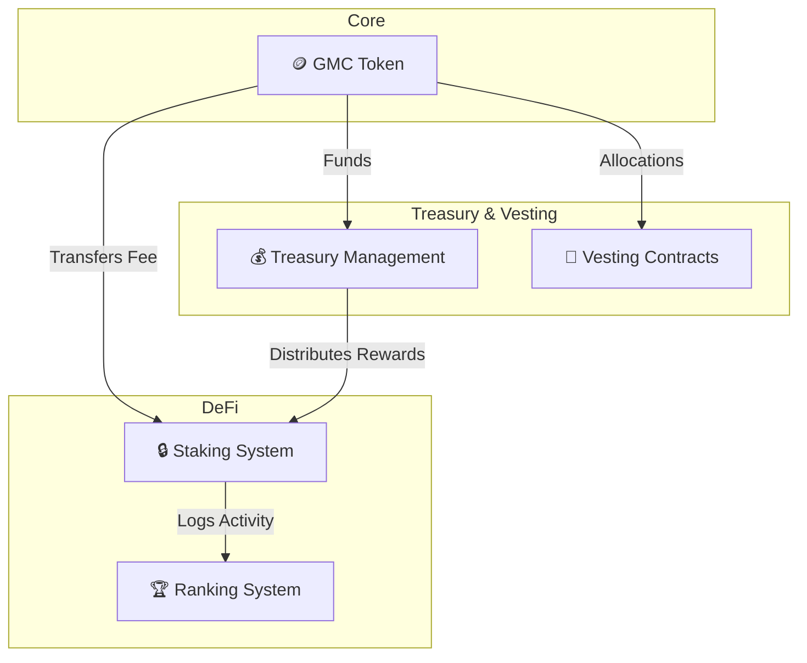
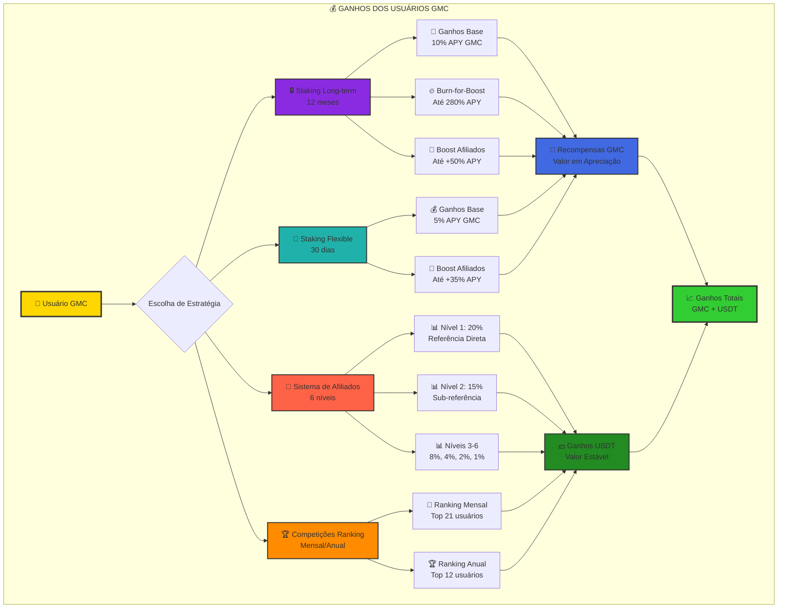
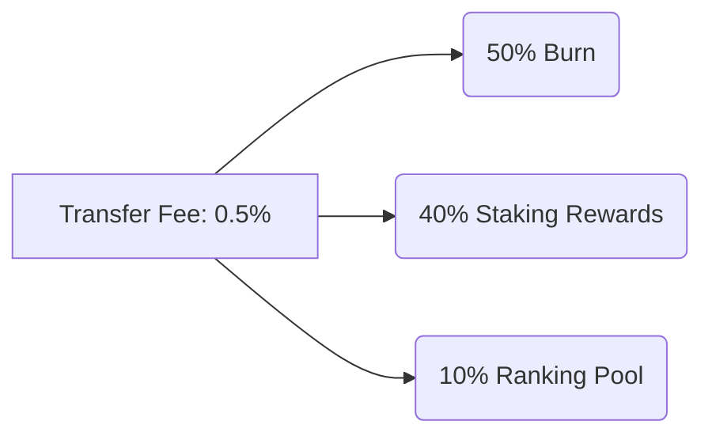

# 🥇 GMC Token Ecosystem

[](https://github.com/goldminingco/GMC-Token/actions)
[](https://opensource.org/licenses/MIT)
[](https://discord.gg/gmc-token)

**GMC Token** is a complete DeFi ecosystem on the Solana blockchain that combines advanced tokenomics, an innovative staking system, a multi-level affiliate program, and gamification mechanics through ranking and burn-for-boost.

## 🌟 Overview

The GMC Token Ecosystem is designed to create a sustainable and incentivized economy where users are rewarded for active participation, long-term staking, and community building through the affiliate system.

### 🎯 Key Features

- **🪙 Deflationary Token**: Automatic burn on transactions to reduce supply.
- **📈 Flexible and Long-Term Staking**: Dynamic APY from 5% to 280% to reward loyalty.
- **🤝 Affiliate System**: 6 levels of rewards to encourage community growth.
- **🔥 Burn-for-Boost**: A unique mechanism to burn tokens in exchange for a permanent APY increase.
- **🏆 Ranking System**: Monthly and annual rewards for the most engaged users.
- **⏳ Time-Lock Governance**: An extra layer of security for critical administrative changes.

## 🏗️ System Architecture

The GMC Ecosystem architecture is modular and designed for maximum security and efficiency. Each contract has a clear responsibility, minimizing complexity and the attack surface.



## 💰 Oportunidades de Ganhos para Usuários

Os usuários do ecossistema GMC têm múltiplas oportunidades de ganhos, combinando recompensas em GMC (com potencial de valorização) e recompensas em USDT (valor estável). O sistema foi projetado para recompensar diferentes tipos de participação e estratégias de investimento.



### 🎯 Resumo das Oportunidades de Ganho

| Tipo de Ganho | Recompensa | Moeda | Potencial Máximo |
|---------------|------------|-------|------------------|
| **Staking Long-term** | 10%-280% APY | GMC | Até 280% APY com burn-for-boost |
| **Staking Flexible** | 5%-70% APY | GMC | Até 70% APY com afiliados |
| **Afiliados Nível 1** | 20% das recompensas | USDT | Sem limite |
| **Afiliados Nível 2** | 15% das recompensas | USDT | Sem limite |
| **Afiliados Níveis 3-6** | 8%, 4%, 2%, 1% | USDT | Sem limite |
| **Ranking Mensal** | Pool variável | USDT | Top 21 usuários |
| **Ranking Anual** | Pool maior | USDT | Top 12 usuários |

### 💡 Estratégias de Maximização de Ganhos

1. **🔒 Estratégia Long-term**: Stake por 12 meses + burn-for-boost + afiliados = até 330% APY
2. **🌊 Estratégia Flexible**: Stake flexível + afiliados ativos = até 105% APY
3. **🤝 Estratégia Afiliados**: Foco na construção de rede = ganhos recorrentes em USDT
4. **🏆 Estratégia Competitiva**: Participação ativa + volume alto = premiações ranking

## 💰 Tokenomics

### Total Supply: 100,000,000 GMC

| Category | Amount | Percentage | Vesting |
|-----------|------------|-------------|---------|
| **Initial Circulation** | 20,000,000 | 20% | Immediate |
| **Staking Rewards** | 30,000,000 | 30% | 5 years |
| **Ranking Rewards** | 10,000,000 | 10% | 3 years |
| **Team & Advisors** | 15,000,000 | 15% | 4 years (1-year cliff) |
| **Strategic Reserve** | 20,000,000 | 20% | 5 years |
| **Liquidity & Marketing** | 5,000,000 | 5% | 2 years |

### Deflationary Mechanics

The ecosystem has multiple burn mechanisms to ensure the token's long-term scarcity.

- **Transaction Fee**: 0.5% (automatic distribution).
- **Burn-for-Boost**: Voluntary burn to increase APY.
- **Penalties**: Early unstaking burns a portion of the tokens.



## 🔒 Staking System

### Long-Term Staking (12 months)

- **Base APY**: 10%
- **Maximum APY**: 280% (with burn-for-boost)
- **Minimum Stake**: 100 GMC
- **Lock Period**: 365 days
- **Early Exit Penalty**: 50% principal + 80% interest

### Flexible Staking (30 days)

- **Base APY**: 5%
- **Maximum APY**: 70% (with affiliates)
- **Minimum Stake**: 50 GMC
- **Lock Period**: 30 days
- **Cancellation Penalty**: 2.5%

### 🔥 Burn-for-Boost Mechanism

Users can burn GMC to permanently increase the APY of their long-term positions:

- **Ratio**: 1 GMC burned = 2.7% additional APY
- **Maximum**: 270% boost (from 10% to 280%)
- **Fee**: 10% GMC + 0.8 USDT per operation
- **Permanent**: Boost is maintained for the entire duration of the stake.

## 🤝 Affiliate System (6 Levels)

### Reward Structure

| Level | Percentage | Requirements |
|-------|-------------|------------|
| **Level 1** | 20% | Direct referral |
| **Level 2** | 15% | Sub-referral |
| **Level 3** | 8% | 3rd level |
| **Level 4** | 4% | 4th level |
| **Level 5** | 2% | 5th level |
| **Level 6** | 1% | 6th level |

### APY Boost from Affiliates

- **Long-Term**: Up to 50% additional boost
- **Flexible**: Up to 35% additional boost
- **Based on**: Staking power of referrals

## 🏆 Ranking System

### Monthly Rewards

- **Pool**: Variable (based on activity)
- **Eligibility**: All users (except top 20 holders)
- **Distribution**: Based on Merkle Tree
- **Criteria**: Staking volume, burns, affiliates

### Annual Rewards

- **Pool**: Larger than monthly
- **Eligibility**: Users active for 12 months
- **Distribution**: Based on annual performance
- **Criteria**: Contribution to the ecosystem

### 🛡️ Time-Lock Governance

- **Period**: 48 hours
- **Function**: Changes to Merkle Root
- **Process**: Proposal → Waiting Period → Execution
- **Security**: Transparency for the community

## 🔧 Installation and Development

### Prerequisites

```bash
# Install Rust
curl --proto '=https' --tlsv1.2 -sSf https://sh.rustup.rs | sh

# Install Solana CLI
sh -c "$(curl -sSfL https://release.solana.com/stable/install)"

# Install Anchor
npm install -g @coral-xyz/anchor-cli

# Install Node.js dependencies
npm install
```

### Build and Deploy

```bash
# Build all contracts (may require --no-idl flag, see troubleshooting docs)
anchor build

# Deploy to localnet
anchor deploy --provider.cluster localnet

# Deploy to devnet
anchor deploy --provider.cluster devnet

# Run tests
anchor test
```

### Project Structure

The structure follows the Anchor standard to facilitate development and auditing.

```
GMC-Token/
├── programs/
│   ├── gmc_token/          # Main token contract
│   ├── gmc_staking/        # Staking system
│   ├── gmc_ranking/        # Ranking system
│   ├── gmc_treasury/       # Treasury management
│   └── gmc_vesting/        # Vesting contracts
├── tests/                  # Automated tests (TDD)
├── app/                    # Frontend (in development)
├── docs/                   # Detailed documentation
└── scripts/                # Deploy and utility scripts
```

## 🧪 Tests

The project follows a rigorous Test-Driven Development (TDD) methodology.

### Test Coverage

- **Token Contract**: ✅ ~98% coverage
- **Staking System**: ✅ ~95% coverage
- **Ranking System**: ✅ ~90% coverage
- **Treasury**: ✅ ~90% coverage
- **Vesting**: ✅ ~90% coverage

### Running Tests

```bash
# All tests
npm test

# Specific tests
npm run test:token
npm run test:staking
npm run test:ranking

# Tests with coverage
npm run test:coverage
```

## 🔐 Security

Security is the fundamental pillar of the GMC Ecosystem.

### Audits and Analyses
- **Internal Audit**: Completed, covering all contracts and business logic.
- **Preparation for External Audit**: Documentation and processes are ready. See [SECURITY_AUDIT_PREPARATION.md](./Docs/SECURITY_AUDIT_PREPARATION.md).
- **Compilation Analysis**: Resolved. See [COMPILATION_ANALYSIS.md](./Docs/COMPILATION_ANALYSIS.md).

### Security Controls
- **Multi-signature**: Administrative wallets for critical operations.
- **Time-locks**: 48-hour delay for changes in ranking governance.
- **Pausability**: Contracts with pause functions for emergencies.
- **Access Control**: `Signer` and `require!` validations in all restricted functions.

### Best Practices
- **Overflow Protection**: Use of `checked_*` for all arithmetic.
- **Reentrancy Guards**: Anchor's native protection against re-entrancy.
- **Input Validation**: Strict validation of all user inputs.
- **Error Handling**: Custom errors for clarity and debugging.
- **Troubleshooting**: Detailed guides for [signature issues](./Docs/ANCHOR_SIGNATURE_TROUBLESHOOTING.md) and [linter issues](./Docs/LINTER_GHOST_SOLUTION.md).


## 📊 Metrics and Monitoring

### Key KPIs

- **TVL (Total Value Locked)**: Total value in staking
- **Burn Rate**: Token burn rate
- **Average APY**: Average system APY
- **Active Users**: Monthly unique users
- **Affiliate Volume**: Volume generated by affiliates

### Dashboard (in development)

- Real-time metrics
- Performance history
- User analysis
- Financial reports

## 🛣️ Roadmap

### Phase 1: Foundation (Completed) ✅
- [x] Core contract development
- [x] Complete staking system
- [x] Time-lock governance
- [x] Automated tests
- [x] Internal Audit & Documentation

### Phase 2: Launch (Current) 🚀
- [ ] External audit by a specialized firm
- [ ] Testnet deployment and Bug Bounty program
- [ ] Frontend web application development
- [ ] Official Mainnet launch

### Phase 3: Expansion (2025+)
- [ ] Integration with major DEXs
- [ ] Liquidity program
- [ ] Strategic partnerships
- [ ] Ecosystem expansion with new utilities
- [ ] Cross-chain bridges & advanced analytics

## 🤝 Contributing

### How to Contribute

1. **Fork** the repository
2. **Create** a branch for your feature (`git checkout -b feature/AmazingFeature`)
3. **Commit** your changes (`git commit -m 'Add some AmazingFeature'`)
4. **Push** to the branch (`git push origin feature/AmazingFeature`)
5. **Open** a Pull Request

### Guidelines
- Follow existing code standards.
- Add tests for new features.
- Document significant changes.
- Keep commits atomic and descriptive.

### Local Development
```bash
# Clone the repository
git clone https://github.com/goldminingco/GMC-Token.git

# Install dependencies
cd GMC-Token
npm install

# Configure local environment
cp .env.example .env

# Start development
npm run dev
```

## 📚 Documentation

### 🎯 Frontend Development Documentation

Complete documentation for frontend developers with all endpoints, data structures, and integration flows:

- **[Frontend Endpoints Guide](./Docs/FRONTEND_ENDPOINTS_GUIDE.md)** - Complete guide with all endpoints and data structures
- **[System Parameters](./Docs/SYSTEM_PARAMETERS.md)** - Complete system parameters and business rules
- **[Executive Summary](./Docs/EXECUTIVE_SUMMARY.md)** - Executive summary of the project and architecture
- **[Documentation Index](./Docs/README_FRONTEND_DOCS.md)** - Navigation index for all documentation

### 📊 Visual Resources
- **Architecture Diagram** - Overview of the 5 smart contracts
- **Flow Diagram** - User journey and data flows
- **Data Diagram** - Data structure and relationships

### 🔧 Technical Resources
- **34 Endpoints** documented (Token: 4, Staking: 12, Ranking: 10, Treasury: 3, Vesting: 5)
- **TypeScript Structures** for all data types
- **Utility Functions** for calculations and formatting
- **Security Guides** and performance optimization

### Additional Resources
- **[Whitepaper](./Docs/WHITEPAPER_EN.md)**: Complete technical documentation
- **[Tokenomics](./Docs/tokenomics.md)**: Detailed economic analysis
- **[Security Audit Checklist](./Docs/SECURITY_AUDIT_CHECKLIST.md)**: Security checklist
- **[Project Analysis](./Docs/GMC_PROJECT_ANALYSIS_REPORT.md)**: Technical report

### Troubleshooting Guides
- **[Signature](./Docs/ANCHOR_SIGNATURE_TROUBLESHOOTING.md)**
- **[Linter](./Docs/LINTER_GHOST_SOLUTION.md)**
- **[Compilation](./Docs/COMPILATION_ANALYSIS.md)**

## 💬 Community

### Official Channels

- **Website**: [gmc-token.com](https://gmc-token.com)
- **Telegram**: [@GMCTokenOfficial](https://t.me/GMCTokenOfficial)
- **Twitter**: [@GMCToken](https://twitter.com/GMCToken)
- **Discord**: [GMC Community](https://discord.gg/gmc-token)

### Support

- **Email**: officialgoldmining@gmail.com
- **Documentation**: [docs.gmc-token.com](https://docs.gmc-token.com)
- **GitHub Issues**: For bugs and feature requests

## 📄 License

This project is licensed under the MIT License - see the [LICENSE](LICENSE) file for details.

## ⚠️ Disclaimer

GMC Token is a DeFi project. Always do your own research (DYOR) before investing. Smart contracts, although audited, may contain risks. Never invest more than you can afford to lose.

---

**Built with ❤️ by the GMC Community**

*Transforming the digital economy through smart incentives and decentralized governance.* 