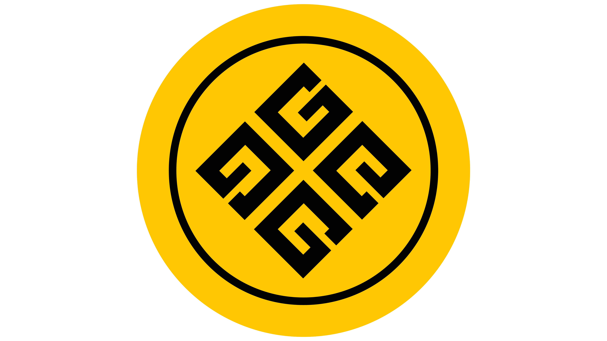

# Gold Mining Token (GMC) - The Solana DeFi Ecosystem 🪙

**GMC Token is not just a digital asset; it's a complete Decentralized Finance (DeFi) ecosystem built on the Solana blockchain. Our mission is to democratize access to passive income through a transparent, secure, and highly rewarding staking system, backed by a deflationary tokenomics model designed for long-term sustainability.**

This repository contains the official Rust-based smart contracts for the GMC Token ecosystem, developed with a security-first approach following DevSecOps and TDD best practices.

---

### 🔗 **Total Transparency Links**

- **Token Address (GMC):** [`AUz16jzWuxSpZ3aKANmpocxWUUG6w5qDd1hiGnoUFMXb`](https://solscan.io/token/AUz16jzWuxSpZ3aKANmpocxWUUG6w5qDd1hiGnoUFMXb)
- **Main Smart Contract:** [`4Pq7MMWfUSWQ8inc9XsKvMXM1NjkkQHV9QE4dr6b61US`](https://solscan.io/account/4Pq7MMWfUSWQ8inc9XsKvMXM1NjkkQHV9QE4dr6b61US)
- **Official Website:** [goldmining.co](https://goldmining.co/en/)

---

## 🚀 Ecosystem Modules & Benefits: A Deep Dive

Our ecosystem is a suite of interconnected smart contracts, each designed to deliver specific value and synergize with the others.

### 1. 🏦 **Intelligent Staking with Dynamic APY**
The core of our ecosystem is a sophisticated staking system that caters to different investor profiles.

-   **Long-Term Staking (12-Month Lock):**
    -   **High Rewards:** Earn a dynamic APY ranging from a base of **10% up to an incredible 280%**.
    -   **Ideal For:** Long-term believers in the project who want to maximize their returns.
    -   **Daily Payouts:** Rewards are calculated and distributed daily.
    -   **Minimum Stake:** 100 GMC.

-   **Flexible Staking (No Lock-in):**
    -   **Flexibility:** Earn a solid APY from **5% up to 70%** without locking your tokens.
    -   **Ideal For:** Investors who want passive income with the freedom to withdraw at any time.
    -   **30-Day Cycles:** Rewards are paid out in 30-day cycles.
    -   **Minimum Stake:** 50 GMC.

-   **Security:** To guarantee reward payouts, **70,000,000 GMC (70% of the total supply)** is securely locked in the smart contract's PDA, controlled only by the program's logic.

### 2. 🔥 **Burn-for-Boost: Amplify Your APY**
This is one of our key innovations, allowing committed users to significantly increase their earning potential.

-   **Mechanism:** By burning a small amount of GMC, you permanently increase the APY on your **Long-Term Staking** positions.
-   **Powerful Incentive:** This feature allows you to boost your base APY by an additional **270%**, creating a path to reach the maximum 280% APY.
-   **Deflationary Impact:** Every use of this feature contributes to reducing the total supply of GMC, increasing its scarcity and value.

### 3. 🤝 **Multi-Level Affiliate System**
We believe in community growth and reward our users for helping expand the ecosystem.

-   **Passive Income Stream:** Earn a percentage of the rewards generated by the users you refer, across **6 levels of depth**.
-   **APY Boost:** An active referral network can boost your own staking APY by up to **50%**.
-   **Network Effect:** This system is designed to create exponential community growth, benefiting all token holders.

### 4. 🏛️ **Secure Treasury & Governance**
The financial health and governance of the project are secured on-chain.

-   **Multisig Security:** **12,000,000 GMC** are locked in a multisignature treasury contract, requiring multiple approvals for any transaction.
-   **Decentralized Control:** This prevents unilateral decisions and ensures that funds are managed securely and transparently, according to the project's roadmap and governance proposals.

### 5. ⏰ **Vesting for Team & Strategic Reserve**
To ensure long-term alignment and project stability, funds for the team and strategic reserve are managed by smart contracts.

-   **Locked Funds:** **12,000,000 GMC** (2M for the Team, 10M for the Strategic Reserve) are locked in vesting contracts.
-   **Gradual Release:** Funds are released on a pre-defined schedule with cliff periods, guaranteeing the team's long-term commitment.

### 6. 📉 **Deflationary Tokenomics**
The GMC token is designed to become scarcer over time.

-   **Automatic Burn:** A **0.5% fee** is applied to every GMC transfer. **50% of this fee is permanently burned**.
-   **Sustainable Rewards:** The remaining fee is redistributed to fuel the ecosystem:
    -   **40% to the Staking Pool**, ensuring a continuous flow of rewards for stakers.
    -   **10% to the Ranking Program**, rewarding community engagement.

---

## 📊 **Mainnet Token Distribution**

For maximum transparency, below are the public addresses for the main funds. The majority of the supply is held in Program Derived Addresses (PDAs), controlled by the smart contract's logic, not a single person.

| Fund | Public Address |
|---|---|
| **Staking Rewards Pool (70M GMC)** | `5EGhNNXm91UZSAUpj3qtmiAPM8JDFztkbqnXxBziHMq1` (PDA) |
| **Treasury & Strategic Reserve (12M GMC)** | `4Qr5wBt7J243VDSCiTHgXUSxZpGWUJA1MiXx2DrsBgMv` (PDA) |
| **Presale (8M GMC)** | `8Sjs8HkDzuDGQdFZnR1NfQs5eujJbBFCmcUpEnLNtG5J` |
| **Marketing (6M GMC)** | `dVan4q1sLhcAte5RGyp5KXr9X9mung296Y998CKiHTb` |
| **Team Vesting (2M GMC)** | `8mStzLX9S28pydomkmPd9Yop4LXLJWn9sEdxg5qJwy7L` (PDA) |
| **Airdrop (2M GMC)** | `DEX9sqfg2kPArZsRHtJAYrL3DV629YJsYysqGP58u77j` |

---

## 🛠️ **Getting Started**

1.  **Add the GMC Token** to your preferred Solana wallet (Phantom, Solflare, etc.) using the token address.
2.  **Acquire GMC tokens** on supported exchanges (coming soon).
3.  **Visit our official dApp** (coming soon) to participate in the staking ecosystem.
4.  **Follow our social channels** for the latest updates and announcements.

---

**GMC Token: Transforming Gold Mining into Real Profitability with the Security and Transparency of the Blockchain.**