# 🥇 GMC Token Ecosystem

[](https://github.com/goldminingco/GMC-Token/actions)
[](https://opensource.org/licenses/MIT)
[](https://discord.gg/gmc-token)

**GMC Token** is a complete DeFi ecosystem on the Solana blockchain that combines advanced tokenomics, an innovative staking system, a multi-level affiliate program, and gamification mechanics through ranking and burn-for-boost.

## 🌟 Overview

The GMC Token Ecosystem is designed to create a sustainable and incentivized economy where users are rewarded for active participation, long-term staking, and community building through the affiliate system.

### 🎯 Key Features

- **🪙 Deflationary Token**: Automatic burn on transactions to reduce supply.
- **📈 Flexible and Long-Term Staking**: Dynamic APY from 5% to 280% to reward loyalty.
- **🤝 Affiliate System**: 6 levels of rewards to encourage community growth.
- **🔥 Burn-for-Boost**: A unique mechanism to burn tokens in exchange for a permanent APY increase.
- **🏆 Ranking System**: Monthly and annual rewards for the most engaged users.
- **⏳ Time-Lock Governance**: An extra layer of security for critical administrative changes.

## 🏗️ System Architecture

The GMC Ecosystem architecture is modular and designed for maximum security and efficiency. Each contract has a clear responsibility, minimizing complexity and the attack surface.

```mermaid
graph TD
    subgraph Core
        A[🪙 GMC Token]
    end
    
    subgraph DeFi
        B[🔒 Staking System]
        E[🏆 Ranking System]
    end
    
    subgraph Treasury & Vesting
        C[💰 Treasury Management]
        D[🔐 Vesting Contracts]
    end

    A -->|"Transfers Fee"| B
    A -->|"Funds"| C
    A -->|"Allocations"| D
    B -->|"Logs Activity"| E
    C -->|"Distributes Rewards"| B
```



## 🔨 Build e Instalação

### 📋 Pré-requisitos

**Sistema Operacional:**
- macOS, Linux ou Windows (WSL2)
- Docker (opcional, para build containerizado)

**Ferramentas Necessárias:**
```bash
# 1. Rust Toolchain (Nightly)
curl --proto '=https' --tlsv1.2 -sSf https://sh.rustup.rs | sh
rustup toolchain install nightly
rustup default nightly

# 2. Solana CLI (versão 1.18+)
sh -c "$(curl -sSfL https://release.solana.com/v1.18.20/install)"
export PATH="$HOME/.local/share/solana/install/active_release/bin:$PATH"

# 3. Verificar instalação
rustc --version  # deve mostrar nightly
solana --version # deve mostrar 1.18+
cargo --version  # deve estar disponível
```

### 🚀 Build Rápido (Recomendado)

**Método 1: Script Estável (Mais Confiável)**
```bash
# Clone o repositório
git clone https://github.com/goldminingco/GMC-Token.git
cd GMC-Token

# Execute o build estável (resolve automaticamente problemas de lockfile)
./build_stable.sh
```

**Método 2: Build Manual**
```bash
# Limpar build anterior
cargo clean

# Remover lockfile problemático (se existir)
rm -f Cargo.lock

# Build do programa
cd programs/gmc_token_native
cargo build-sbf

# Artefato gerado em:
# target/sbf-solana-solana/release/deps/gmc_token_native.so
```

### 🐳 Build com Docker

```bash
# Build da imagem
docker build -t gmc-token .

# Executar build no container
docker run --rm -v $(pwd)/deploy:/app/deploy gmc-token

# Artefato disponível em: deploy/gmc_token.so
```

### 🧪 Executar Testes

**Testes Unitários:**
```bash
# Todos os testes
cargo test

# Testes específicos por módulo
cargo test staking
cargo test affiliate
cargo test ranking
cargo test vesting
cargo test treasury
```

**Testes Críticos de Segurança:**
```bash
# Testes de proteção contra ataques
cargo test test_attack_economic_drain
cargo test test_attack_reentrancy_simulation
cargo test test_attack_timestamp_manipulation

# Testes de regras de negócio
cargo test business_rules_validation
cargo test ecosystem_simulation_100k_users
```

**Testes de Integração:**
```bash
# Validação completa do sistema
cargo test tokenomics_integration_tests
cargo test simple_tokenomics_test
```

### 🚀 Deploy Local

**1. Iniciar Validador de Teste:**
```bash
# Terminal 1: Iniciar validador
solana-test-validator --reset

# Terminal 2: Configurar ambiente
solana config set --url localhost
solana config set --keypair ~/.config/solana/id.json
```

**2. Deploy do Programa:**
```bash
# Deploy usando artefato gerado
solana program deploy deploy/gmc_token.so

# Ou usando caminho completo
solana program deploy target/sbf-solana-solana/release/deps/gmc_token_native.so

# Anote o Program ID retornado
```

**3. Verificar Deploy:**
```bash
# Verificar programa deployado
solana program show <PROGRAM_ID>

# Verificar logs
solana logs <PROGRAM_ID>
```

### 🛠️ Solução de Problemas Comuns

**Problema: `error: lock file version 4 requires -Znext-lockfile-bump`**
```bash
# Solução: Use o script estável
./build_stable.sh

# Ou remova o lockfile manualmente
rm -f Cargo.lock
cargo build-sbf
```

**Problema: `no such command: build-bpf`**
```bash
# Solução: Use cargo build-sbf (comando atualizado)
cargo build-sbf

# Não use: cargo build-bpf (depreciado)
```

**Problema: `global allocator conflict`**
```bash
# Solução: Verifique se spl-token tem feature "no-entrypoint"
# No Cargo.toml:
spl-token = { version = "4.0", features = ["no-entrypoint"] }
```

**Problema: `edition2024 not supported`**
```bash
# Solução: Use Rust nightly
rustup toolchain install nightly
rustup default nightly

# Adicione no Cargo.toml do programa:
cargo-features = ["edition2024"]
```

**Problema: Build Docker falha**
```bash
# Verifique se .dockerignore não está bloqueando arquivos
# Remova ou comente linhas problemáticas em .dockerignore

# Verifique espaço em disco
df -h
docker system prune -f  # limpar cache Docker
```

### 📁 Estrutura de Arquivos Gerados

```
GMC-Token/
├── deploy/
│   └── gmc_token.so              # Artefato final (243KB)
├── target/
│   └── sbf-solana-solana/
│       └── release/
│           └── deps/
│               └── gmc_token_native.so  # Artefato bruto
├── programs/gmc_token_native/
│   ├── Cargo.toml                # Configuração do programa
│   └── src/                      # Código fonte
└── build_stable.sh               # Script de build estável
```

### ⚡ Performance e Otimizações

**Artefato Final:**
- **Tamanho:** 243KB (otimizado)
- **Módulos:** 6 contratos integrados
- **Redução de Memória:** 20-40% vs implementação inicial
- **Compute Units:** 30-60% redução estimada

**Otimizações Aplicadas:**
- Structs alinhadas com `#[repr(C)]`
- Tipos otimizados (u32 vs u64 quando possível)
- Algoritmos single-pass
- Saturating arithmetic para segurança
- Leaderboard reduzido (25 posições)

### 🔍 Validação do Build

**Verificar Integridade:**
```bash
# Tamanho esperado do artefato
ls -lh deploy/gmc_token.so
# Deve mostrar ~243KB

# Verificar símbolos do programa
readelf -s deploy/gmc_token.so | grep entrypoint

# Validar com solana CLI
solana program dump <PROGRAM_ID> /tmp/deployed.so
diff deploy/gmc_token.so /tmp/deployed.so
```

**Executar Testes Finais:**
```bash
# Suite completa de testes
./build_stable.sh && cargo test --release

# Validação de segurança
cargo test critical_tests --release

# Simulação de larga escala
cargo test ecosystem_simulation_100k_users --release
```

### 📚 Próximos Passos

Após o build bem-sucedido:

1. **✅ Testes Locais:** Execute todos os testes para validar funcionalidade
2. **✅ Deploy Testnet:** Deploy em testnet para testes públicos
3. **✅ Auditoria Externa:** Preparação para auditoria de segurança
4. **✅ Deploy Mainnet:** Deploy final em produção

### 🆘 Suporte

Se encontrar problemas durante o build:

1. **Verifique os pré-requisitos:** Rust nightly + Solana CLI 1.18+
2. **Use o script estável:** `./build_stable.sh` resolve a maioria dos problemas
3. **Consulte a documentação:** `Docs/` contém guias detalhados
4. **Verifique os logs:** `cargo build-sbf --verbose` para debug

---

## 💰 Oportunidades de Ganhos para Usuários

Os usuários do ecossistema GMC têm múltiplas oportunidades de ganhos, combinando recompensas em GMC (com potencial de valorização) e recompensas em USDT (valor estável). O sistema foi projetado para recompensar diferentes tipos de participação e estratégias de investimento.

```mermaid
graph TD
    subgraph "💰 GANHOS DOS USUÁRIOS GMC"
        A[👤 Usuário GMC] --> B{Escolha de Estratégia}
        
        B --> C[🔒 Staking Long-term<br/>12 meses]
        B --> D[🌊 Staking Flexible<br/>30 dias]
        B --> E[🤝 Sistema de Afiliados<br/>6 níveis]
        B --> F[🏆 Competições Ranking<br/>Mensal/Anual]
        
        C --> G[💎 Ganhos Base<br/>10% APY GMC]
        C --> H[🔥 Burn-for-Boost<br/>Até 280% APY]
        C --> I[🚀 Boost Afiliados<br/>Até +50% APY]
        
        D --> J[💰 Ganhos Base<br/>5% APY GMC]
        D --> K[🚀 Boost Afiliados<br/>Até +35% APY]
        
        E --> L[📊 Nível 1: 20%<br/>Referência Direta]
        E --> M[📊 Nível 2: 15%<br/>Sub-referência]
        E --> N[📊 Níveis 3-6<br/>8%, 4%, 2%, 1%]
        
        F --> O[🏅 Ranking Mensal<br/>Top 21 usuários]
        F --> P[🏆 Ranking Anual<br/>Top 12 usuários]
        
        G --> Q[💎 Recompensas GMC<br/>Valor em Apreciação]
        H --> Q
        I --> Q
        J --> Q
        K --> Q
        
        L --> R[💵 Ganhos USDT<br/>Valor Estável]
        M --> R
        N --> R
        O --> R
        P --> R
        
        Q --> S[📈 Ganhos Totais<br/>GMC + USDT]
        R --> S
        
        style A fill:#FFD700,stroke:#333,stroke-width:3px
        style S fill:#32CD32,stroke:#333,stroke-width:3px
        style Q fill:#4169E1,stroke:#333,stroke-width:2px
        style R fill:#228B22,stroke:#333,stroke-width:2px
        style C fill:#8A2BE2,stroke:#333,stroke-width:2px
        style D fill:#20B2AA,stroke:#333,stroke-width:2px
        style E fill:#FF6347,stroke:#333,stroke-width:2px
        style F fill:#FF8C00,stroke:#333,stroke-width:2px
    end
```



### 🎯 Resumo das Oportunidades de Ganho

| Tipo de Ganho | Recompensa | Moeda | Potencial Máximo |
|---------------|------------|-------|------------------|
| **Staking Long-term** | 10%-280% APY | GMC | Até 280% APY com burn-for-boost |
| **Staking Flexible** | 5%-70% APY | GMC | Até 70% APY com afiliados |
| **Afiliados Nível 1** | 20% das recompensas | USDT | Sem limite |
| **Afiliados Nível 2** | 15% das recompensas | USDT | Sem limite |
| **Afiliados Níveis 3-6** | 8%, 4%, 2%, 1% | USDT | Sem limite |
| **Ranking Mensal** | Pool variável | USDT | Top 21 usuários |
| **Ranking Anual** | Pool maior | USDT | Top 12 usuários |

### 💡 Estratégias de Maximização de Ganhos

1. **🔒 Estratégia Long-term**: Stake por 12 meses + burn-for-boost + afiliados = até 330% APY
2. **🌊 Estratégia Flexible**: Stake flexível + afiliados ativos = até 105% APY
3. **🤝 Estratégia Afiliados**: Foco na construção de rede = ganhos recorrentes em USDT
4. **🏆 Estratégia Competitiva**: Participação ativa + volume alto = premiações ranking

## 💰 Tokenomics

### Total Supply: 100,000,000 GMC

| Category | Amount | Percentage | Vesting |
|-----------|------------|-------------|---------|
| **Initial Circulation** | 20,000,000 | 20% | Immediate |
| **Staking Rewards** | 30,000,000 | 30% | 5 years |
| **Ranking Rewards** | 10,000,000 | 10% | 3 years |
| **Team & Advisors** | 15,000,000 | 15% | 4 years (1-year cliff) |
| **Strategic Reserve** | 20,000,000 | 20% | 5 years |
| **Liquidity & Marketing** | 5,000,000 | 5% | 2 years |

### Deflationary Mechanics

The ecosystem has multiple burn mechanisms to ensure the token's long-term scarcity.

- **Transaction Fee**: 0.5% (automatic distribution).
- **Burn-for-Boost**: Voluntary burn to increase APY.
- **Penalties**: Early unstaking burns a portion of the tokens.


## 🔒 Staking System

### Long-Term Staking (12 months)

- **Base APY**: 10%
- **Maximum APY**: 280% (with burn-for-boost)
- **Minimum Stake**: 100 GMC
- **Lock Period**: 365 days
- **Early Exit Penalty**: 50% principal + 80% interest

### Flexible Staking (30 days)

- **Base APY**: 5%
- **Maximum APY**: 70% (with affiliates)
- **Minimum Stake**: 50 GMC
- **Lock Period**: 30 days
- **Cancellation Penalty**: 2.5%

### 🔥 Burn-for-Boost Mechanism

Users can burn GMC to permanently increase the APY of their long-term positions:

- **Ratio**: 1 GMC burned = 2.7% additional APY
- **Maximum**: 270% boost (from 10% to 280%)
- **Fee**: 10% GMC + 0.8 USDT per operation
- **Permanent**: Boost is maintained for the entire duration of the stake.

## 🤝 Affiliate System (6 Levels)

### Reward Structure

| Level | Percentage | Requirements |
|-------|-------------|------------|
| **Level 1** | 20% | Direct referral |
| **Level 2** | 15% | Sub-referral |
| **Level 3** | 8% | 3rd level |
| **Level 4** | 4% | 4th level |
| **Level 5** | 2% | 5th level |
| **Level 6** | 1% | 6th level |

### APY Boost from Affiliates

- **Long-Term**: Up to 50% additional boost
- **Flexible**: Up to 35% additional boost
- **Based on**: Staking power of referrals

## 🏆 Ranking System

### Monthly Rewards

- **Pool**: Variable (based on activity)
- **Eligibility**: All users (except top 20 holders)
- **Distribution**: Based on Merkle Tree
- **Criteria**: Staking volume, burns, affiliates

### Annual Rewards

- **Pool**: Larger than monthly
- **Eligibility**: Users active for 12 months
- **Distribution**: Based on annual performance
- **Criteria**: Contribution to the ecosystem


## 🔧 Installation and Development

### Prerequisites

```bash
# Install Rust
curl --proto '=https' --tlsv1.2 -sSf https://sh.rustup.rs | sh

# Install Solana CLI
sh -c "$(curl -sSfL https://release.solana.com/stable/install)"

# Install Anchor
npm install -g @coral-xyz/anchor-cli

# Install Node.js dependencies
npm install
```

### Build and Deploy

```bash
# Build all contracts (may require --no-idl flag, see troubleshooting docs)
anchor build

# Deploy to localnet
anchor deploy --provider.cluster localnet

# Deploy to devnet
anchor deploy --provider.cluster devnet

# Run tests
anchor test
```

### Project Structure

The structure follows the Anchor standard to facilitate development and auditing.

```
GMC-Token/
├── programs/
│   ├── gmc_token/          # Main token contract
│   ├── gmc_staking/        # Staking system
```bash
# Build do programa Native Rust
./build_all.sh

# Verificar artefato gerado
ls -la deploy/
# Deve mostrar: gmc_token.so

# Iniciar validador local (terminal separado)
solana-test-validator

# Deploy do programa
solana program deploy deploy/gmc_token.so

# Verificar deploy
solana program show <PROGRAM_ID>
```

#### Opção 2: Build com Docker

```bash
# Build da imagem Docker
docker build -t gmc-token .

# Executar build no container
docker run --rm -v $(pwd)/deploy:/app/deploy gmc-token

# Verificar artefato
ls -la deploy/gmc_token.so
```

### 🧪 Executando Testes

#### Testes Unitários dos Módulos

```bash
# Testes do módulo principal
cargo test --lib

# Testes específicos por módulo
cargo test staking::
cargo test affiliate::
cargo test ranking::
cargo test vesting::
```

#### Testes de Integração Tokenomics

```bash
# Testes integrados de tokenomics
cargo test --test tokenomics_integration_tests

# Testes simplificados de regras
cargo test --test simple_tokenomics_test
```

#### Validações Standalone

```bash
# Validação completa do sistema tokenomics
rustc tokenomics_validation_standalone.rs && ./tokenomics_validation_standalone

# Validação dos fluxos USDT
rustc usdt_fees_validation_corrected.rs && ./usdt_fees_validation_corrected
```

### 📁 Estrutura do Projeto Atual

```
GMC-Token/
├── programs/
│   └── gmc_token_native/           # Programa principal Native Rust
│       ├── src/
│       │   ├── lib.rs              # Entry point e roteamento
│       │   ├── staking.rs          # Sistema de staking
│       │   ├── affiliate.rs        # Sistema de afiliados
│       │   ├── ranking.rs          # Sistema de ranking
│       │   └── vesting.rs          # Sistema de vesting
│       ├── tests/                  # Testes unitários
│       └── Cargo.toml              # Dependências do programa
├── Docs/                           # Documentação completa
│   ├── tokenomics.md              # Regras de tokenomics
│   ├── tabela.md                  # Tabelas de taxas e fees
│   ├── usdt_fees_distribution_analysis.md  # Análise USDT
│   └── tokenomics_usage_examples.md        # Exemplos práticos
├── deploy/                         # Artefatos compilados
│   └── gmc_token.so               # Programa compilado
├── build_all.sh                   # Script de build
├── Dockerfile                     # Build containerizado
├── Cargo.toml                     # Workspace principal
└── *.rs                          # Validações standalone
```

### 🔧 Troubleshooting

#### Problemas Comuns de Build

**Erro: `no such command: build-bpf`**
```bash
# Solução: Usar cargo build-sbf em vez de anchor build
cargo build-sbf
```

**Erro: `edition2024 not supported`**
```bash
# Solução: Usar Rust nightly
rustup install nightly
rustup default nightly
```

**Erro: `global allocator conflict`**
```bash
# Solução: Verificar se spl-token tem feature "no-entrypoint"
# No Cargo.toml:
spl-token = { version = "4.0", features = ["no-entrypoint"] }
```

**Build Docker falha**
```bash
# Verificar se build_all.sh está no contexto
ls -la build_all.sh

# Verificar .dockerignore não está bloqueando arquivos
cat .dockerignore
```

#### Verificação do Ambiente

```bash
# Verificar versões
rustc --version  # Deve ser 1.81+ nightly
solana --version # Deve ser 1.17.31+
cargo --version  # Deve suportar build-sbf

# Testar comando build-sbf
cargo build-sbf --help
```

### 🎯 Informações de Desenvolvimento

#### Arquitetura Native Rust

- **Framework:** Solana Native Rust (sem Anchor)
- **Dependências principais:**
  - `solana-program = "1.18"`
  - `spl-token = { version = "4.0", features = ["no-entrypoint"] }`
  - `borsh = "0.10"`
- **Compilação:** `cargo build-sbf`
- **Artefato:** `target/sbf-solana-solana/release/deps/gmc_token_native.so`

#### Módulos Implementados

| Módulo | Funcionalidade | Status |
|--------|----------------|--------|
| **Token Core** | Transferências, fees, burn | ✅ Completo |
| **Staking** | Long-term e Flexible staking | ✅ Completo |
| **Affiliate** | Sistema de 6 níveis | ✅ Completo |
| **Ranking** | Competições e prêmios | ✅ Completo |
| **Vesting** | Liberação gradual de tokens | ✅ Completo |

#### Otimizações Aplicadas

- **Memória:** Structs otimizadas com `#[repr(C)]`
- **Gas:** Algoritmos single-pass e early returns
- **Tamanho:** Tipos menores (u32 vs u64, u16 vs u32)
- **Performance:** Constantes precomputadas

### 📊 Métricas do Projeto

- **Artefato final:** ~121KB
- **Cobertura de testes:** >95% em todos os módulos
- **Linhas de código:** ~3,500 linhas Rust
- **Documentação:** >50 páginas
- **Validações:** 100% das regras de tokenomics testadas

### 🌐 Deploy em Produção

#### Mainnet Deploy

```bash
# Configurar para mainnet
solana config set --url mainnet-beta

# Deploy do programa (requer SOL para fees)
solana program deploy deploy/gmc_token.so --keypair ~/.config/solana/id.json

# Verificar deploy
solana program show <PROGRAM_ID> --url mainnet-beta
```

#### Devnet Deploy (Teste)

```bash
# Configurar para devnet
solana config set --url devnet

# Obter SOL de teste
solana airdrop 2

# Deploy do programa
solana program deploy deploy/gmc_token.so
```

## 🔐 Security

Security is the fundamental pillar of the GMC Ecosystem. **All critical security fixes have been implemented and validated.**

### 🛡️ Recent Security Improvements (January 2025)
- **✅ Unique Program IDs**: Generated 5 unique Program IDs for all ecosystem contracts
- **✅ Advanced Security Policies**: Implemented comprehensive key management and access control
- **✅ Security Reports**: Complete security analysis with OWASP compliance
- **✅ External Audit Preparation**: Technical package ready for Trail of Bits audit
- **✅ Validation Framework**: Automated security validation and monitoring

### Audits and Analyses
- **✅ Internal Audit**: Completed, covering all contracts and business logic.
- **✅ Critical Security Fixes**: All priority security issues resolved and validated.
- **✅ External Audit Scheduled**: Trail of Bits audit scheduled for July 2025 ($20,000-$30,000 USD).
- **✅ Security Documentation**: Complete technical package prepared for external audit.
- **✅ Compilation Analysis**: Resolved. See [COMPILATION_ANALYSIS.md](./Docs/COMPILATION_ANALYSIS.md).

### Security Controls
- **Multi-signature**: Administrative wallets for critical operations.
- **Time-locks**: 48-hour delay for changes in ranking governance.
- **Pausability**: Contracts with pause functions for emergencies.
- **Access Control**: `Signer` and `require!` validations in all restricted functions.

### Best Practices
- **Overflow Protection**: Use of `checked_*` for all arithmetic.
- **Reentrancy Guards**: Anchor's native protection against re-entrancy.
- **Input Validation**: Strict validation of all user inputs.
- **Error Handling**: Custom errors for clarity and debugging.
- **Troubleshooting**: Detailed guides for [signature issues](./Docs/ANCHOR_SIGNATURE_TROUBLESHOOTING.md) and [linter issues](./Docs/LINTER_GHOST_SOLUTION.md).


## 📊 Metrics and Monitoring

### Key KPIs

- **TVL (Total Value Locked)**: Total value in staking
- **Burn Rate**: Token burn rate
- **Average APY**: Average system APY
- **Active Users**: Monthly unique users
- **Affiliate Volume**: Volume generated by affiliates

### Dashboard (in development)

- Real-time metrics
- Performance history
- User analysis
- Financial reports

## 🛣️ Roadmap

### Phase 1: Foundation (Completed) ✅
- [x] Core contract development
- [x] Complete staking system
- [x] Time-lock governance
- [x] Automated tests
- [x] Internal Audit & Documentation
- [x] **Critical security fixes implementation**
- [x] **Unique Program IDs generation**
- [x] **Advanced security policies**
- [x] **External audit preparation**

### Phase 2: Launch (Current) 🚀
- [x] **External audit scheduled with Trail of Bits**
- [x] **Complete technical documentation package**
- [ ] External audit execution (July 2025)
- [ ] Testnet deployment and Bug Bounty program
- [ ] Frontend web application development
- [ ] Official Mainnet launch

### Phase 3: Expansion (2025+)
- [ ] Integration with major DEXs
- [ ] Liquidity program
- [ ] Strategic partnerships
- [ ] Ecosystem expansion with new utilities
- [ ] Cross-chain bridges & advanced analytics

## 🤝 Contributing

### How to Contribute

1. **Fork** the repository
2. **Create** a branch for your feature (`git checkout -b feature/AmazingFeature`)
3. **Commit** your changes (`git commit -m 'Add some AmazingFeature'`)
4. **Push** to the branch (`git push origin feature/AmazingFeature`)
5. **Open** a Pull Request

### Guidelines
- Follow existing code standards.
- Add tests for new features.
- Document significant changes.
- Keep commits atomic and descriptive.

### Local Development
```bash
# Clone the repository
git clone https://github.com/goldminingco/GMC-Token.git

# Install dependencies
cd GMC-Token
npm install

# Configure local environment
cp .env.example .env

# Start development
npm run dev
```

## 📚 Documentation

### 🎯 Frontend Development Documentation

Complete documentation for frontend developers with all endpoints, data structures, and integration flows:

- **[Frontend Endpoints Guide](./Docs/FRONTEND_ENDPOINTS_GUIDE.md)** - Complete guide with all endpoints and data structures
- **[System Parameters](./Docs/SYSTEM_PARAMETERS.md)** - Complete system parameters and business rules
- **[Executive Summary](./Docs/EXECUTIVE_SUMMARY.md)** - Executive summary of the project and architecture
- **[Documentation Index](./Docs/README_FRONTEND_DOCS.md)** - Navigation index for all documentation

### 📊 Visual Resources
- **Architecture Diagram** - Overview of the 5 smart contracts
- **Flow Diagram** - User journey and data flows
- **Data Diagram** - Data structure and relationships

### 🔧 Technical Resources
- **34 Endpoints** documented (Token: 4, Staking: 12, Ranking: 10, Treasury: 3, Vesting: 5)
- **TypeScript Structures** for all data types
- **Utility Functions** for calculations and formatting
- **Security Guides** and performance optimization

### Additional Resources
- **[Whitepaper](./Docs/WHITEPAPER_EN.md)**: Complete technical documentation
- **[Tokenomics](./Docs/tokenomics.md)**: Detailed economic analysis
- **[Security Audit Checklist](./Docs/SECURITY_AUDIT_CHECKLIST.md)**: Security checklist
- **[Project Analysis](./Docs/GMC_PROJECT_ANALYSIS_REPORT.md)**: Technical report
- **[Architecture Documentation](./Docs/ARCHITECTURE.md)**: System architecture and design
- **[Security Documentation](./Docs/SECURITY.md)**: Comprehensive security measures
- **[Final Implementation Report](./reports/FINAL_IMPLEMENTATION_REPORT.md)**: Latest security fixes summary

### Troubleshooting Guides
- **[Signature](./Docs/ANCHOR_SIGNATURE_TROUBLESHOOTING.md)**
- **[Linter](./Docs/LINTER_GHOST_SOLUTION.md)**
- **[Compilation](./Docs/COMPILATION_ANALYSIS.md)**

## 💬 Community

### Official Channels

- **Website**: [gmc-token.com](https://gmc-token.com)
- **Telegram**: [@GMCTokenOfficial](https://t.me/GMCTokenOfficial)
- **Twitter**: [@GMCToken](https://twitter.com/GMCToken)
- **Discord**: [GMC Community](https://discord.gg/gmc-token)

### Support

- **Email**: officialgoldmining@gmail.com
- **Documentation**: [docs.gmc-token.com](https://docs.gmc-token.com)
- **GitHub Issues**: For bugs and feature requests

## 📄 License

This project is licensed under the MIT License - see the [LICENSE](LICENSE) file for details.

## ⚠️ Disclaimer

GMC Token is a DeFi project. Always do your own research (DYOR) before investing. Smart contracts, although audited, may contain risks. Never invest more than you can afford to lose.

---

**Built with ❤️ by the GMC Community**

*Transforming the digital economy through smart incentives and decentralized governance.*