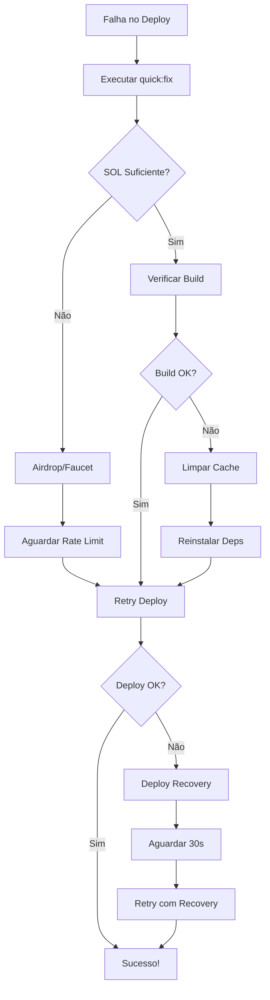

# 🔧 GMC Deploy Troubleshooting Guide

Este guia resolve os problemas mais comuns durante o deploy do GMC Token Ecosystem.

## 🚨 Problemas Comuns e Soluções Rápidas

### 1. **SOL Insuficiente**
```bash
# Solução automática
npm run quick:fix

# Ou manualmente
solana airdrop 5
# Se falhar, tente:
curl -X POST https://faucet.solana.com/request -H 'Content-Type: application/json' -d '{"address":"$(solana address)"}'
```

### 2. **Rate Limit do Airdrop**
```bash
# Use o script de deploy com recovery
npm run deploy:recovery:devnet

# Ou aguarde 1 hora e tente novamente
```

### 3. **Problemas de Assinatura**
```bash
# Diagnóstico
npm run check:signature

# Se der erro de keypair, regenere:
solana-keygen new --outfile ~/.config/solana/id.json
```

### 4. **Falha no Build**
```bash
# Limpeza completa
anchor clean
yarn install
anchor build

# Ou use o quick fix
npm run quick:fix
```

## 🎯 Scripts Disponíveis

### Deploy
| Script | Descrição |
|--------|-----------|
| `npm run deploy:recovery:devnet` | Deploy com recuperação automática |
| `npm run deploy:recovery:testnet` | Deploy testnet com recovery |
| `npm run deploy:devnet` | Deploy padrão devnet |

### Testes
| Script | Descrição |
|--------|-----------|
| `npm run test:performance` | Testes de performance |
| `npm run test:e2e` | Testes end-to-end |
| `npm run test:unit` | Testes unitários |

### Diagnóstico
| Script | Descrição |
|--------|-----------|
| `npm run quick:fix` | Diagnóstico e correção rápida |
| `npm run check:signature` | Verificar configuração de assinatura |
| `npm run check:linter` | Verificar saúde do linter |

## 📋 Checklist de Deploy

### Antes do Deploy
- [ ] Verificar saldo SOL (`solana balance`)
- [ ] Confirmar network (`solana config get`)
- [ ] Build limpo (`anchor clean && anchor build`)
- [ ] Testes passando (`npm run test:unit`)

### Durante o Deploy
- [ ] Usar script de recovery se falhar
- [ ] Aguardar rate limits se necessário
- [ ] Verificar logs de erro

### Após o Deploy
- [ ] Validar contratos deployados
- [ ] Executar testes de performance
- [ ] Verificar saldo final

## 🔄 Fluxo de Recuperação



## 🛠️ Comandos de Emergência

### Reset Completo
```bash
# Limpar tudo
anchor clean
rm -rf node_modules
rm -rf target
yarn install
anchor build

# Reconfigurar Solana
solana config set --url devnet
solana airdrop 5
```

### Verificação de Saúde
```bash
# Status do sistema
npm run quick:fix

# Verificar versões
anchor --version
solana --version
node --version
```

### Backup de Emergência
```bash
# Salvar configuração atual
cp ~/.config/solana/id.json backup_keypair.json
solana config get > backup_config.txt
```

## 🎉 Próximos Passos

Após resolver os problemas:

1. **Deploy Bem-sucedido**: Execute os testes de performance
   ```bash
   npm run test:performance
   ```

2. **Validação**: Confirme todos os contratos
   ```bash
   npm run test:e2e
   ```

3. **Monitoramento**: Verificar logs e métricas

---

## 📞 Suporte

Se os problemas persistirem:
1. Execute `npm run quick:fix` e compartilhe a saída
2. Verifique os logs em `~/.config/solana/cli/logs/`
3. Confirme as versões das ferramentas

**Última atualização**: $(date) 